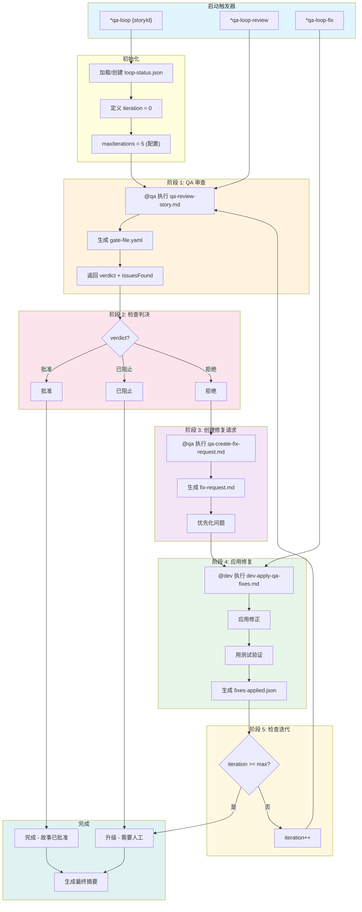
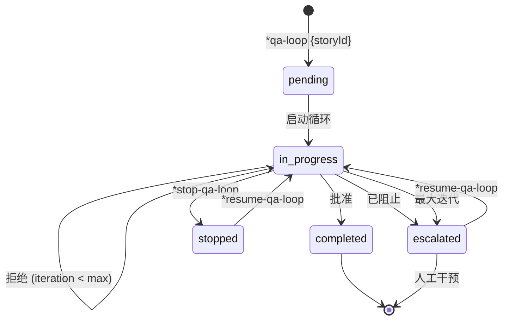
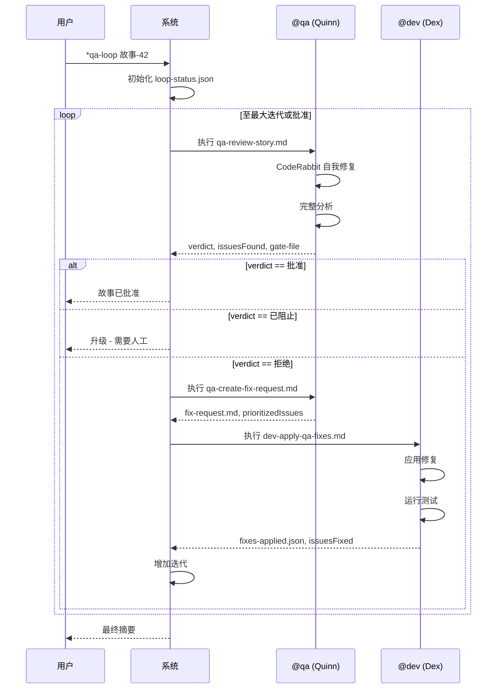
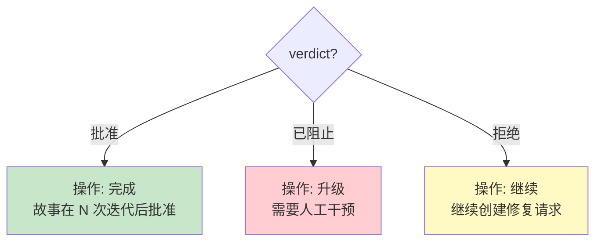
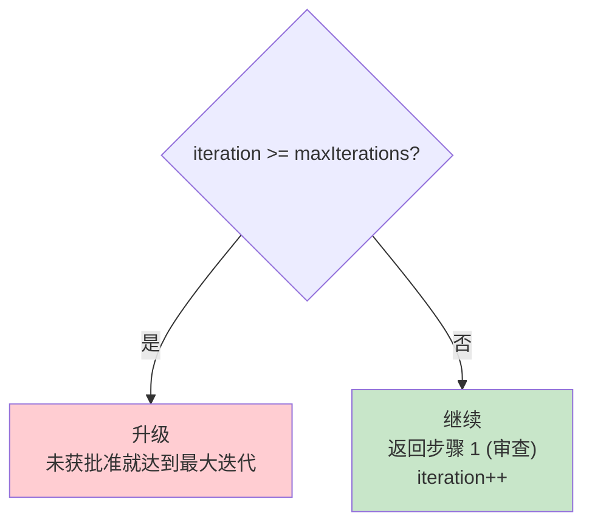
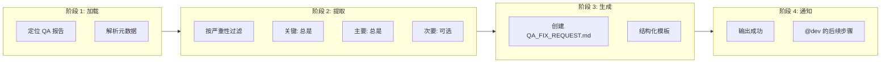
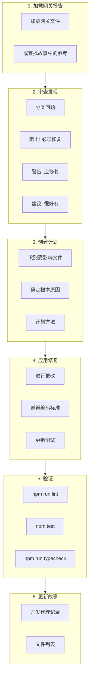
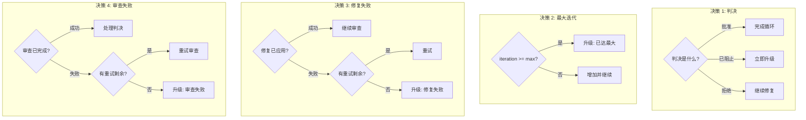
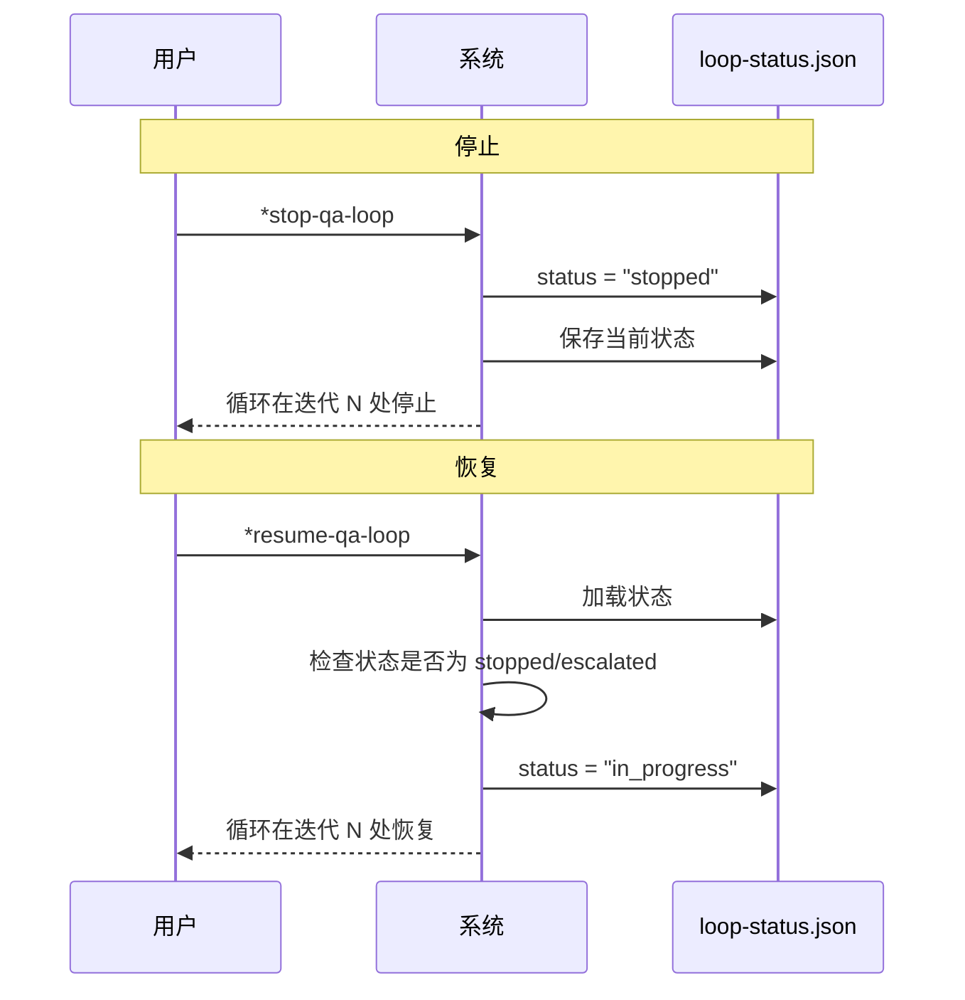

# QA循环工作流 - 完整文档

**版本:** 1.0
**最后更新:** 2026-02-04
**Epic:** 6 - QA 演进: 自主开发引擎 (ADE)
**故事:** 6.5
**作者:** @architect (Aria)

---

## 索引

1. [概览](#概览)
2. [工作流图示](#工作流图示)
3. [详细步骤](#详细步骤)
4. [参与的代理](#参与的代理)
5. [执行的任务](#执行的任务)
6. [前置条件](#前置条件)
7. [输入和输出](#输入和输出)
8. [决策点](#决策点)
9. [配置](#配置)
10. [执行控制](#执行控制)
11. [升级](#升级)
12. [与仪表板集成](#与仪表板集成)
13. [错误处理](#错误处理)
14. [故障排查](#故障排查)
15. [参考](#参考)

---

## 概览

**QA循环编排器**是一个自动化工作流，编排完整的质量审查循环:

```
审查 -> 修复 -> 重新审查
```

此工作流执行最多可配置的迭代 (默认: 5)，追踪每次迭代的结果。达到最大限制或请求手动停止时，工作流升级为人工干预。

### 目的

- 自动化质量审查循环
- 减少反馈和修正之间的时间
- 确保 QA 过程的完整可追溯性
- 必要时自动升级

### 支持的项目类型

- `aios-development`
- `autonomous-development`
- `qa-automation`

---

## 工作流图示

### 主流程



### 状态图



### 代理之间的通信序列



---

## 详细步骤

### 步骤 1: 审查 (阶段 1)

| 属性 | 值 |
|------|-----|
| **名称** | `review` |
| **阶段** | 1 - QA 审查 |
| **代理** | `@qa` (Quinn) |
| **任务** | `qa-review-story.md` |
| **超时** | 30 分钟 (1,800,000 毫秒) |

**描述:**
执行故事实现的完整 QA 审查，产生判决: 批准、拒绝或已阻止。

**输入:**

```yaml
storyId: "{storyId}"
iteration: "{currentIteration}"
previousIssues: "{history[-1].issuesFound|0}"
```

**输出:**

- `gate-file.yaml` - 带决策的网关文件
- `verdict` - 批准 | 拒绝 | 已阻止
- `issuesFound` - 发现的问题数

**成功时:**
```
log: "审查完成: {verdict} ({issuesFound} 个问题)"
next: check_verdict
```

**失败时:**
```
action: retry (最多 2 次尝试)
on_exhausted: escalate
```

---

### 步骤 2: 检查判决 (阶段 2)

| 属性 | 值 |
|------|-----|
| **名称** | `check_verdict` |
| **阶段** | 2 - 判决检查 |
| **代理** | `system` |

**描述:**
评估审查的判决并确定下一步操作。

**决策逻辑:**



---

### 步骤 3: 创建修复请求 (阶段 3)

| 属性 | 值 |
|------|-----|
| **名称** | `create_fix_request` |
| **阶段** | 3 - 创建修复请求 |
| **代理** | `@qa` (Quinn) |
| **任务** | `qa-create-fix-request.md` |

**描述:**
从审查的发现结果生成结构化的修复请求文档。优先化问题并提供可操作的修复说明。

**输入:**

```yaml
storyId: "{storyId}"
gateFile: "{outputs.review.gate-file}"
iteration: "{currentIteration}"
```

**输出:**

- `QA_FIX_REQUEST.md` - 带优先化问题的文档
- `prioritizedIssues` - 按优先级排序的问题列表

**成功时:**
```
log: "修复请求已创建，共 {prioritizedIssues.length} 个优先化问题"
next: fix_issues
```

**失败时:**
```
action: continue
fallback: "使用原始网关文件进行修复"
```

---

### 步骤 4: 修复问题 (阶段 4)

| 属性 | 值 |
|------|-----|
| **名称** | `fix_issues` |
| **阶段** | 4 - 应用修复 |
| **代理** | `@dev` (Dex) |
| **任务** | `dev-apply-qa-fixes.md` |
| **超时** | 60 分钟 (3,600,000 毫秒) |

**描述:**
开发代理根据修复请求应用修正。执行测试并验证更改。

**输入:**

```yaml
storyId: "{storyId}"
fixRequest: "{outputs.create_fix_request.fix-request}"
iteration: "{currentIteration}"
```

**输出:**

- `fixes-applied.json` - 已应用修正的记录
- `issuesFixed` - 修复的问题数

**成功时:**
```
log: "已修复 {issuesFixed} 个问题，共 {issuesFound} 个"
next: increment_iteration
```

**失败时:**
```
action: retry (最多 2 次尝试)
on_exhausted: escalate，原因 "开发代理在重试后无法应用修复"
```

---

### 步骤 5: 增加迭代 (阶段 5)

| 属性 | 值 |
|------|-----|
| **名称** | `increment_iteration` |
| **阶段** | 5 - 检查迭代 |
| **代理** | `system` |

**描述:**
增加迭代计数器并针对最大值进行检查。如果达到最大值，则升级给人工。

**逻辑:**



---

## 参与的代理

### @qa - Quinn (测试架构师)

```yaml
名字: Quinn
ID: qa
标题: 测试架构师和质量顾问
图标: ✅
原型: 守护者
星座: 处女座

QA循环中的责任:
  - 执行完整 QA 审查 (qa-review-story.md)
  - 创建结构化修复请求 (qa-create-fix-request.md)
  - 确定判决: 批准、拒绝、已阻止
  - 生成带决策的网关文件
```

**使用的工具:**

| 工具 | 目的 |
|------|------|
| `github-cli` | 代码审查和 PR 管理 |
| `browser` | 端到端测试和 UI 验证 |
| `context7` | 研究测试框架 |
| `supabase` | 数据库测试和数据验证 |
| `coderabbit` | 自动化代码审查 |

**CodeRabbit 集成:**

```yaml
self_healing:
  enabled: true
  type: full
  max_iterations: 3
  timeout_minutes: 30
  severity_filter: [CRITICAL, HIGH]
  behavior:
    CRITICAL: auto_fix
    HIGH: auto_fix
    MEDIUM: document_as_debt
    LOW: ignore
```

---

### @dev - Dex (全栈开发人员)

```yaml
名字: Dex
ID: dev
标题: 全栈开发人员
图标: 💻
原型: 构造者
星座: 水瓶座

QA循环中的责任:
  - 根据修复请求应用修正 (dev-apply-qa-fixes.md)
  - 执行测试来验证修正
  - 更新故事中的开发代理记录
  - 确保修复不会破坏现有功能
```

**使用的工具:**

| 工具 | 目的 |
|------|------|
| `git` | 本地操作: add、commit、status、diff |
| `context7` | 查阅库文档 |
| `supabase` | 数据库操作 |
| `browser` | 测试 Web 应用 |
| `coderabbit` | 提前提交代码质量审查 |

---

### 系统代理

```yaml
类型: 自动
责任:
  - 检查判决
  - 增加迭代
  - 控制工作流流程
  - 管理循环状态
```

---

## 执行的任务

### 1. qa-review-story.md

**位置:** `.aios-core/development/tasks/qa-review-story.md`

**目的:** 执行带质量网关决策的测试架构审查。

**审查过程:**

```text
flowchart TD
    subgraph PRE["审查前"]
        P1["CodeRabbit 自我修复循环"]
        P2["最多 3 次迭代 CRITICAL/HIGH"]
    end

    subgraph RISK["风险评估"]
        R1["认证/支付/安全?"]
        R2["未添加测试?"]
        R3["Diff > 500 行?"]
        R4["前一个网关失败?"]
        R5["> 5 个 AC?"]
    end

    subgraph ANALYSIS["完整分析"]
        A1["需求可追溯性"]
        A2["代码质量审查"]
        A3["测试架构评估"]
        A4["NFR 验证"]
        A5["可测试性评估"]
        A6["技术债识别"]
    end

    subgraph OUTPUT["输出"]
        O1["QA 结果部分"]
        O2["gate-file.yaml"]
    end

    PRE --> RISK
    RISK --> ANALYSIS
    ANALYSIS --> OUTPUT
```

**网关标准:**

| 网关 | 条件 |
|------|------|
| **通过** | 所有关键需求得到满足，无阻止问题 |
| **关切** | 发现非关键问题，团队应审查 |
| **失败** | 关键问题应处理 |
| **放弃** | 问题被明确接受 |

---

### 2. qa-create-fix-request.md

**位置:** `.aios-core/development/tasks/qa-create-fix-request.md`

**目的:** 根据 QA 发现结果生成结构化的 `QA_FIX_REQUEST.md` 文档给 @dev。

**工作流:**



**修复请求结构:**

```markdown
# QA 修复请求: {storyId}

## @dev 的说明
- 仅修复下面列出的问题
- 不要添加功能或重构无关代码

## 摘要
| 严重性 | 数量 | 状态 |
|--------|------|------|
| 关键 | N | 必须在合并前修复 |
| 主要 | N | 应在合并前修复 |
| 次要 | N | 可选改进 |

## 要修复的问题
### 1. [关键] {标题}
- 位置: `{file:line}`
- 问题: {描述}
- 预期: {预期}
- 验证: [ ] {步骤}

## 约束
- [ ] 仅修复列出的问题
- [ ] 运行所有测试: `npm test`
- [ ] 运行检查: `npm run lint`
```

---

### 3. dev-apply-qa-fixes.md

**位置:** `.aios-core/development/tasks/dev-apply-qa-fixes.md`

**目的:** 根据 QA 反馈和网关审查应用修复。

**开发工作流:**



**退出标准:**

- 所有阻止问题已解决
- 所有测试通过 (lint、unit、integration)
- 故事文件已更新
- 代码准备重新审查

---

## 前置条件

### 启动 QA 循环的条件

| 条件 | 描述 |
|------|------|
| **故事状态** | 必须处于"审查"状态 |
| **实现完成** | 开发人员已完成所有任务 |
| **文件列表已更新** | 故事文件中的文件列表是最新的 |
| **自动化测试** | 所有自动化测试都通过 |
| **CodeRabbit 已配置** | CLI 在 WSL 中安装 (可选但推荐) |

### 环境配置

```yaml
# 检查 CodeRabbit
wsl bash -c '~/.local/bin/coderabbit auth status'

# 检查 Node.js
node --version  # >= 18

# 检查依赖
npm test        # 应该通过
npm run lint    # 应该通过
```

---

## 输入和输出

### 工作流输入

| 字段 | 类型 | 必需 | 描述 |
|------|------|------|------|
| `storyId` | 字符串 | 是 | 故事标识符 (例如: "故事-42") |
| `maxIterations` | 数字 | 否 | 最大值的覆盖 (默认: 5) |
| `mode` | 字符串 | 否 | `yolo`、`interactive`、`preflight` |

### 工作流输出

| 文件 | 位置 | 描述 |
|------|------|------|
| `loop-status.json` | `qa/loop-status.json` | 循环当前状态 |
| `gate-file.yaml` | `qa/gates/{storyId}.yaml` | 质量网关决策 |
| `QA_FIX_REQUEST.md` | `qa/QA_FIX_REQUEST.md` | 修正文档 |
| `fixes-applied.json` | `qa/fixes-applied.json` | 已应用修正记录 |
| `summary.md` | `qa/summary.md` | 循环最终摘要 |

### 状态文件的架构

```yaml
storyId: 字符串              # 故事 ID
currentIteration: 数字      # 当前迭代
maxIterations: 数字         # 配置的最大值
status: 枚举                 # pending | in_progress | completed | stopped | escalated
startedAt: ISO-8601          # 开始时间戳
updatedAt: ISO-8601          # 最后更新

history:
  - iteration: 数字
    reviewedAt: ISO-8601
    verdict: 批准 | 拒绝 | 已阻止
    issuesFound: 数字
    fixedAt: ISO-8601 | null
    issuesFixed: 数字 | null
    duration: 数字             # 毫秒
```

---

## 决策点

### 决策图



### 升级的标准

| 触发器 | 原因 | 操作 |
|--------|------|------|
| `max_iterations_reached` | 循环达到最大值但未获批准 | 带完整上下文升级 |
| `verdict_blocked` | QA 返回已阻止 | 立即升级 |
| `fix_failure` | @dev 在重试后无法应用修复 | 升级并带错误日志 |
| `manual_escalate` | 用户执行 `*escalate-qa-loop` | 按需升级 |

---

## 配置

### 可配置参数

```yaml
config:
  # 最大迭代次数 (AC2)
  maxIterations: 5
  configPath: autoClaude.qaLoop.maxIterations

  # 进度追踪
  showProgress: true
  verbose: true

  # 状态文件位置 (AC4)
  statusFile: qa/loop-status.json

  # 与仪表板集成 (AC7)
  dashboardStatusPath: .aios/dashboard/status.json
  legacyStatusPath: .aios/status.json

  # 每个阶段的超时 (毫秒)
  reviewTimeout: 1800000    # 30 分钟
  fixTimeout: 3600000       # 60 分钟

  # 重试配置
  maxRetries: 2
  retryDelay: 5000          # 5 秒
```

### 按项目定制

在 `.aios-core/core-config.yaml` 文件中:

```yaml
autoClaude:
  qaLoop:
    maxIterations: 3        # 针对较小项目减少
    reviewTimeout: 900000   # 15 分钟快速审查
    fixTimeout: 1800000     # 30 分钟简单修复
```

---

## 执行控制

### 可用命令

| 命令 | 操作 | 描述 |
|------|------|------|
| `*qa-loop {storyId}` | `start_loop` | 启动完整循环 |
| `*qa-loop-review` | `run_step: review` | 仅从审查步骤启动 |
| `*qa-loop-fix` | `run_step: fix` | 仅从修复步骤启动 |
| `*stop-qa-loop` | `stop_loop` | 停止循环并保存状态 |
| `*resume-qa-loop` | `resume_loop` | 恢复停止/升级的循环 |
| `*escalate-qa-loop` | `escalate` | 强制手动升级 |
| `*qa-loop --reset` | `reset` | 删除状态并重新启动 |

### 停止/恢复流程



---

## 升级

### 升级触发器

```yaml
escalation:
  enabled: true
  triggers:
    - max_iterations_reached
    - verdict_blocked
    - fix_failure
    - manual_escalate
```

### 上下文包

升级发生时，系统准备:

| 项目 | 描述 |
|------|------|
| `loop-status.json` | 循环的完整状态 |
| 网关文件 | 历史记录中所有网关文件 |
| 修复请求 | 所有生成的修复请求 |
| 摘要 | 所有迭代的摘要 |

### 通知消息

```
{storyId} 的 QA 循环升级

原因: {escalation.reason}
已完成的迭代: {currentIteration}
最后判决: {history[-1].verdict}
未解决的问题: {history[-1].issuesFound - history[-1].issuesFixed}

审查上下文包并决定:
1. 恢复循环: *resume-qa-loop {storyId}
2. 手动修复并批准
3. 拒绝故事并创建后续
```

### 通知渠道

- `log` - 系统日志
- `console` - 终端输出

---

## 与仪表板集成

### 状态 JSON 架构

```yaml
integration:
  status_json:
    track_loop: true
    field: qaLoop
    update_on_each_iteration: true

    schema:
      storyId: 字符串
      status: 字符串
      currentIteration: 数字
      maxIterations: 数字
      lastVerdict: 字符串
      lastIssuesFound: 数字
      updatedAt: ISO-8601
```

### 项目状态更新

```yaml
project_status:
  update_story_status: true
  status_field: qaLoopStatus
```

### 通知

| 事件 | 消息 | 渠道 |
|------|------|------|
| `on_approve` | "QA 循环已批准: {storyId}" | log |
| `on_escalate` | "QA 循环已升级: {storyId} - 需要关注" | log |
| `on_stop` | "QA 循环已停止: {storyId}" | log |

---

## 错误处理

### 常见错误和解决方案

| 错误 | 原因 | 解决方案 | 操作 |
|------|------|---------|------|
| `missing_story_id` | 未提供故事 ID | "用法: *qa-loop 故事-42" | 提示 |
| `review_timeout` | 审查阶段超过超时 | 检查 QA 代理状态 | 升级 |
| `fix_timeout` | 修复阶段超过超时 | 检查开发代理状态 | 升级 |
| `invalid_status` | 状态文件损坏 | "重置循环: *qa-loop {storyId} --reset" | 暂停 |

### 重试策略

```yaml
on_failure:
  action: retry
  max_retries: 2              # 最大尝试次数
  retryDelay: 5000            # 尝试间延迟
  on_exhausted: escalate      # 重试耗尽时的操作
```

---

## 故障排查

### 问题: 循环在审查时卡住

**症状:**
- 审查在 30 分钟后未完成
- 状态保持"in_progress"

**诊断:**
```bash
# 检查循环状态
cat qa/loop-status.json | jq '.status, .currentIteration'

# 检查最新网关文件
ls -la qa/gates/
```

**解决方案:**
1. 执行 `*stop-qa-loop`
2. 检查 CodeRabbit 是否在响应
3. 执行 `*resume-qa-loop` 恢复

---

### 问题: 修复未应用

**症状:**
- @dev 报告成功但问题仍然存在
- 重新审查发现相同的问题

**诊断:**
```bash
# 检查修复请求
cat qa/QA_FIX_REQUEST.md

# 检查已应用的修复
cat qa/fixes-applied.json
```

**解决方案:**
1. 手动审查 QA_FIX_REQUEST.md
2. 验证 @dev 更新了正确的文件
3. 在重新审查前本地运行测试

---

### 问题: 达到最大迭代

**症状:**
- 循环在 5 次迭代后升级，不获批准

**诊断:**
```bash
# 查看完整历史
cat qa/loop-status.json | jq '.history'
```

**解决方案:**
1. 分析重复问题的模式
2. 检查需求是否清晰
3. 考虑增加 maxIterations 或手动解决

---

### 问题: CodeRabbit 不工作

**症状:**
- 错误 "coderabbit: command not found"
- 自我修复阶段超时

**诊断:**
```bash
# 检查安装
wsl bash -c 'which coderabbit'

# 检查认证
wsl bash -c '~/.local/bin/coderabbit auth status'
```

**解决方案:**
1. 在 WSL 中重新安装 CodeRabbit
2. 执行 `coderabbit auth login`
3. 检查代理配置中的路径

---

### 问题: 状态文件损坏

**症状:**
- 错误 "invalid_status"
- 循环无法启动或恢复

**解决方案:**
```bash
# 备份损坏的文件
mv qa/loop-status.json qa/loop-status.json.bak

# 重新启动循环
*qa-loop {storyId} --reset
```

---

## 参考

### 工作流文件

| 文件 | 位置 |
|------|------|
| 工作流定义 | `.aios-core/development/workflows/qa-loop.yaml` |
| QA 审查任务 | `.aios-core/development/tasks/qa-review-story.md` |
| 创建修复请求任务 | `.aios-core/development/tasks/qa-create-fix-request.md` |
| 应用 QA 修复任务 | `.aios-core/development/tasks/dev-apply-qa-fixes.md` |
| QA 代理 | `.aios-core/development/agents/qa.md` |
| 开发代理 | `.aios-core/development/agents/dev.md` |

### 相关文档

| 文档 | 描述 |
|------|------|
| Epic 6 - QA 演进 | 自主开发引擎的上下文 |
| 故事 6.5 | QA 循环的实现故事 |
| 故事 6.3.3 | CodeRabbit 自我修复集成 |
| ADR-XXX | 架构决策记录 (如果存在) |

### 模板

| 模板 | 位置 | 用途 |
|------|------|------|
| `qa-gate-tmpl.yaml` | `.aios-core/development/templates/` | 网关文件结构 |
| `story-tmpl.yaml` | `.aios-core/development/templates/` | 故事文件结构 |

---

## 变更历史

| 日期 | 版本 | 作者 | 更改 |
|------|------|------|------|
| 2026-02-04 | 1.0 | 技术文档专家 | 初始版本 |

---

*文档自动从工作流 `qa-loop.yaml` 生成*
