# Spec 流水线工作流 - 完整文档

> **版本:** 1.0
> **创建:** 2026-01-28
> **作者:** @architect (Aria)
> **Epic:** Epic 3 - Spec Pipeline
> **状态:** 活跃

---

## 1. 概览

**Spec 流水线**是一个编排工作流，将非正式需求转换为可执行的规范。它是**Auto-Claude ADE** (自主开发引擎) 基础设施的一部分，实现了一个5阶段流程，根据需求复杂性动态适配。

### 1.1 目的

- 将用户的非正式描述转换为正式的、结构化的规范
- 通过验证网关确保质量和一致性
- 根据检测到的复杂性调整深度级别
- 从需求到实现生成可追溯的工件

### 1.2 基本原则

| 原则 | 描述 |
|------|------|
| **无发明** | 无信息发明 - 仅从输入衍生 |
| **可追溯性** | 每个声明必须追溯到需求或研究 |
| **自适应阶段** | 按复杂性自动调整阶段 |
| **质量网关** | 晋级前强制验证 |

---

## 2. 工作流图示

### 2.1 主流程

```mermaid
flowchart TB
    subgraph TRIGGER["触发器"]
        T1["*create-spec 故事-ID"]
        T2["story_created<br/>(autoSpec.enabled)"]
    end

    subgraph PREFLIGHT["飞行前检查"]
        PF1["story_exists<br/>验证/创建目录"]
        PF2["no_existing_spec<br/>避免覆盖"]
        PF3["agents_available<br/>验证配置"]
    end

    subgraph PHASE1["阶段 1: 收集需求"]
        direction TB
        G1["@pm (Morgan)"]
        G2["交互式询问<br/>9个问题类别"]
        G3["requirements.json"]
        G1 --> G2 --> G3
    end

    subgraph PHASE2["阶段 2: 评估复杂性"]
        direction TB
        A1["@architect (Aria)"]
        A2["评估 5 个维度:<br/>范围、集成、基础设施、<br/>知识、风险"]
        A3["complexity.json<br/>简单 | 标准 | 复杂"]
        A1 --> A2 --> A3
    end

    subgraph PHASE3["阶段 3: 研究依赖"]
        direction TB
        R1["@analyst (Atlas)"]
        R2["Context7 + EXA<br/>验证依赖"]
        R3["research.json"]
        R1 --> R2 --> R3
    end

    subgraph PHASE4["阶段 4: 编写规范"]
        direction TB
        W1["@pm (Morgan)"]
        W2["生成 spec.md<br/>无发明"]
        W3["spec.md"]
        W1 --> W2 --> W3
    end

    subgraph PHASE5["阶段 5: 批评规范"]
        direction TB
        C1["@qa (Quinn)"]
        C2["评估 5 个维度:<br/>准确性、完整性、<br/>一致性、可行性、<br/>对齐"]
        C3{"判决"}
        C4["已批准"]
        C5["需要修订"]
        C6["阻止"]
        C1 --> C2 --> C3
        C3 --> C4
        C3 --> C5
        C3 --> C6
    end

    subgraph PHASE5B["阶段 5b: 修订 (复杂)"]
        REV1["@pm (Morgan)"]
        REV2["应用反馈<br/>和自动修复"]
    end

    subgraph PHASE6["阶段 6: 创建计划"]
        direction TB
        P1["@architect (Aria)"]
        P2["生成 implementation.yaml<br/>原子子任务"]
        P3["plan.json"]
        P1 --> P2 --> P3
    end

    subgraph COMPLETION["完成"]
        DONE["流水线完成"]
        ARTIFACTS["生成的工件"]
    end

    T1 --> PREFLIGHT
    T2 --> PREFLIGHT
    PREFLIGHT --> PHASE1
    PHASE1 --> PHASE2
    PHASE2 --> PHASE3
    PHASE3 --> PHASE4
    PHASE4 --> PHASE5
    C4 --> PHASE6
    C5 --> PHASE5B
    PHASE5B --> PHASE5
    C6 -.-> |"上报给 @architect"| HALT["暂停"]
    PHASE6 --> COMPLETION

    style TRIGGER fill:#e1f5fe
    style PREFLIGHT fill:#fff3e0
    style PHASE1 fill:#e8f5e9
    style PHASE2 fill:#fce4ec
    style PHASE3 fill:#f3e5f5
    style PHASE4 fill:#e8f5e9
    style PHASE5 fill:#fff8e1
    style PHASE5B fill:#ffebee
    style PHASE6 fill:#e0f2f1
    style COMPLETION fill:#c8e6c9
```

### 2.2 按复杂性划分的流程

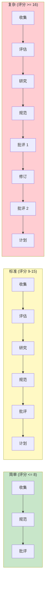

### 2.3 序列图

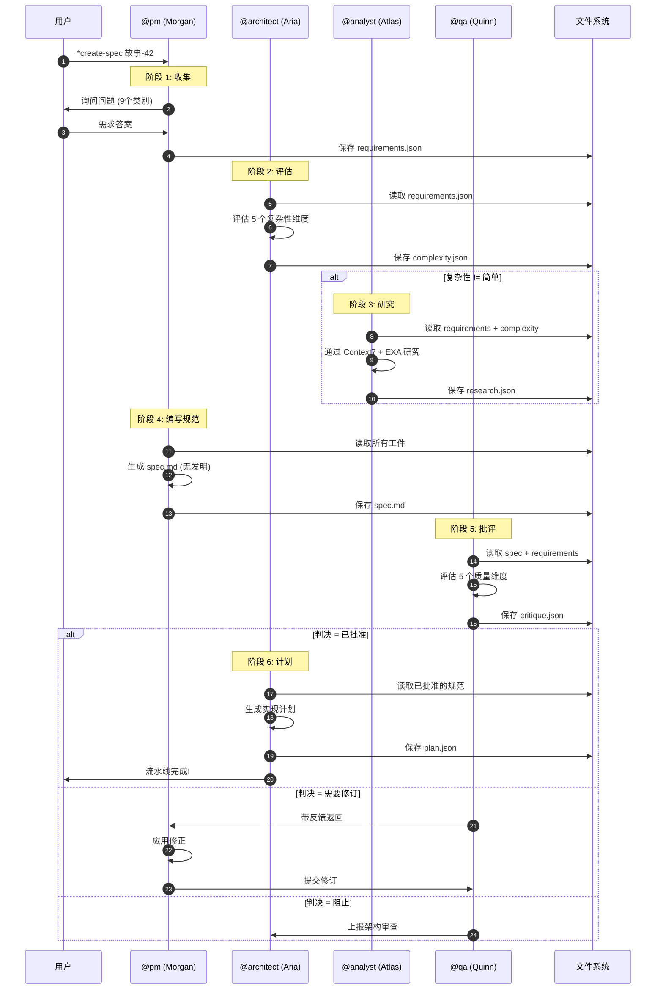

---

## 3. 详细步骤

### 3.1 阶段 1: 收集需求

| 属性 | 值 |
|------|-----|
| **步骤 ID** | `gather` |
| **阶段号** | 1 |
| **代理** | @pm (Morgan) |
| **任务** | `spec-gather-requirements.md` |
| **需要交互** | 是 - 需要用户交互 |

#### 输入

| 输入 | 类型 | 必需 | 描述 |
|-----|------|------|------|
| `storyId` | 字符串 | 是 | 被指定的故事 ID |
| `source` | 枚举 | 否 | 来源: `prd`, `user`, `existing` |
| `prdPath` | 字符串 | 否 | PRD 路径 (如果 source=prd) |

#### 输出

| 输出 | 位置 |
|-----|------|
| `requirements.json` | `docs/stories/{storyId}/spec/requirements.json` |

#### 询问过程 (9 个类别)

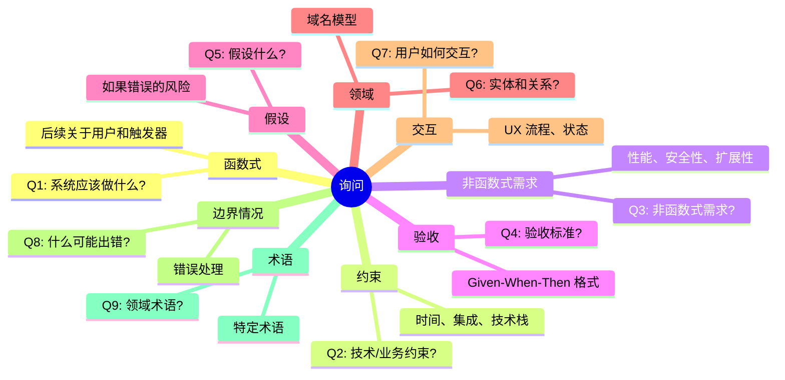

#### 输出结构 (requirements.json)

```json
{
  "storyId": "故事-42",
  "gatheredAt": "2026-01-28T10:00:00Z",
  "source": "user",
  "gatheredBy": "@pm",
  "elicitationVersion": "2.0",
  "functional": [
    {
      "id": "FR-1",
      "description": "允许使用 Google OAuth 登录",
      "priority": "P0",
      "rationale": "主要认证方法",
      "acceptance": ["AC-1"]
    }
  ],
  "nonFunctional": [...],
  "constraints": [...],
  "assumptions": [...],
  "domainModel": [...],
  "interactions": [...],
  "edgeCases": [...],
  "terminology": [...],
  "openQuestions": [...]
}
```

---

### 3.2 阶段 2: 评估复杂性

| 属性 | 值 |
|------|-----|
| **步骤 ID** | `assess` |
| **阶段号** | 2 |
| **代理** | @architect (Aria) |
| **任务** | `spec-assess-complexity.md` |
| **跳过条件** | `source === 'simple'` 或 `overrideComplexity === 'SIMPLE'` |

#### 输入

| 输入 | 类型 | 必需 | 描述 |
|-----|------|------|------|
| `storyId` | 字符串 | 是 | 故事 ID |
| `requirements` | 文件 | 是 | requirements.json |
| `overrideComplexity` | 枚举 | 否 | 手动覆盖: 简单、标准、复杂 |

#### 输出

| 输出 | 位置 |
|-----|------|
| `complexity.json` | `docs/stories/{storyId}/spec/complexity.json` |

#### 5 个复杂性维度

```mermaid
radar
    title 复杂性维度 (1-5)
    "范围" : 3
    "集成" : 4
    "基础设施" : 2
    "知识" : 3
    "风险" : 3
```

| 维度 | 评分 1 | 评分 3 | 评分 5 |
|------|---------|---------|---------|
| **范围** | 1-2 个文件 | 6-10 个文件 | 20+ 个文件 |
| **集成** | 无外部 | 1-2 个外部 API | 多个编排 |
| **基础设施** | 无变化 | 新依赖 | 新基础设施 |
| **知识** | 现有模式 | 新库 | 未知领域 |
| **风险** | 低、隔离 | 中、重要 | 关键、核心 |

#### 分类阈值

| 分类 | 总分 | 已激活阶段 | 估计时间 |
|-------|---------|-----------|---------|
| **简单** | <= 8 | 收集、规范、批评 | 30-60 分钟 |
| **标准** | 9-15 | 收集、评估、研究、规范、批评、计划 | 2-4 小时 |
| **复杂** | >= 16 | + 修订、批评_2 | 4-8 小时 |

---

### 3.3 阶段 3: 研究依赖

| 属性 | 值 |
|------|-----|
| **步骤 ID** | `research` |
| **阶段号** | 3 |
| **代理** | @analyst (Atlas) |
| **任务** | `spec-research-dependencies.md` |
| **跳过条件** | `complexity.result === 'SIMPLE'` |
| **工具** | Context7, EXA |

#### 输入

| 输入 | 类型 | 必需 | 描述 |
|-----|------|------|------|
| `storyId` | 字符串 | 是 | 故事 ID |
| `requirements` | 文件 | 是 | requirements.json |
| `complexity` | 文件 | 是 | complexity.json |

#### 输出

| 输出 | 位置 |
|-----|------|
| `research.json` | `docs/stories/{storyId}/spec/research.json` |

#### 研究流程

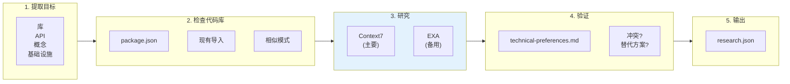

#### 工具优先级

| 工具 | 优先级 | 超时 | 用途 |
|------|--------|------|-----|
| **Context7** | 1 (主要) | 30 秒 | 库文档 |
| **EXA** | 2 (备用) | - | 常规网络搜索 |
| **代码库** | - | - | 检查现有实现 |

---

### 3.4 阶段 4: 编写规范

| 属性 | 值 |
|------|-----|
| **步骤 ID** | `spec` |
| **阶段号** | 4 |
| **代理** | @pm (Morgan) |
| **任务** | `spec-write-spec.md` |
| **宪法网关** | 第四条 - 无发明 |

#### 输入

| 输入 | 类型 | 必需 | 描述 |
|-----|------|------|------|
| `storyId` | 字符串 | 是 | 故事 ID |
| `requirements` | 文件 | 是 | requirements.json |
| `complexity` | 文件 | 否 | complexity.json |
| `research` | 文件 | 否 | research.json |

#### 输出

| 输出 | 位置 |
|-----|------|
| `spec.md` | `docs/stories/{storyId}/spec/spec.md` |

#### 宪法网关: 无发明

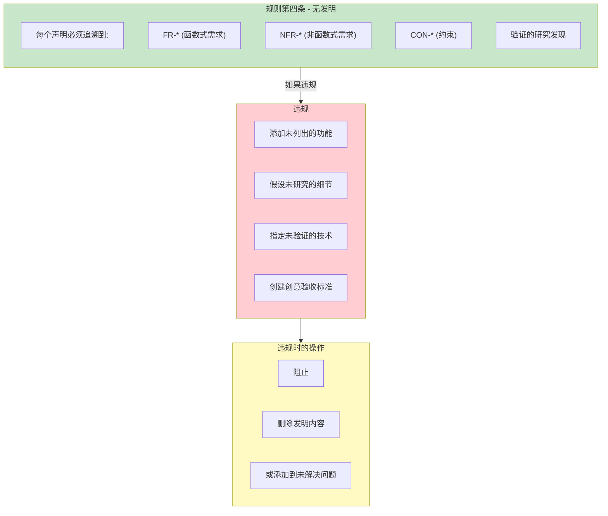

#### spec.md 的结构

```
1. 概览
   1.1 目标
   1.2 非目标
2. 需求总结
   2.1 函数式需求
   2.2 非函数式需求
   2.3 约束
3. 技术方法
   3.1 架构概览
   3.2 组件设计
   3.3 数据流
4. 依赖
   4.1 外部依赖
   4.2 内部依赖
5. 要修改/创建的文件
   5.1 新文件
   5.2 修改的文件
6. 测试策略
   6.1 单元测试
   6.2 集成测试
   6.3 验收测试 (Given-When-Then)
7. 风险和缓解
8. 未解决的问题
9. 实现检查清单
```

---

### 3.5 阶段 5: 批评规范

| 属性 | 值 |
|------|-----|
| **步骤 ID** | `critique` |
| **阶段号** | 5 |
| **代理** | @qa (Quinn) |
| **任务** | `spec-critique.md` |
| **网关** | 阻止 (已批准/需要修订/阻止) |

#### 输入

| 输入 | 类型 | 必需 | 描述 |
|-----|------|------|------|
| `storyId` | 字符串 | 是 | 故事 ID |
| `spec` | 文件 | 是 | spec.md |
| `requirements` | 文件 | 是 | requirements.json |
| `complexity` | 文件 | 否 | complexity.json |
| `research` | 文件 | 否 | research.json |

#### 输出

| 输出 | 位置 |
|-----|------|
| `critique.json` | `docs/stories/{storyId}/spec/critique.json` |

#### 5 个质量维度

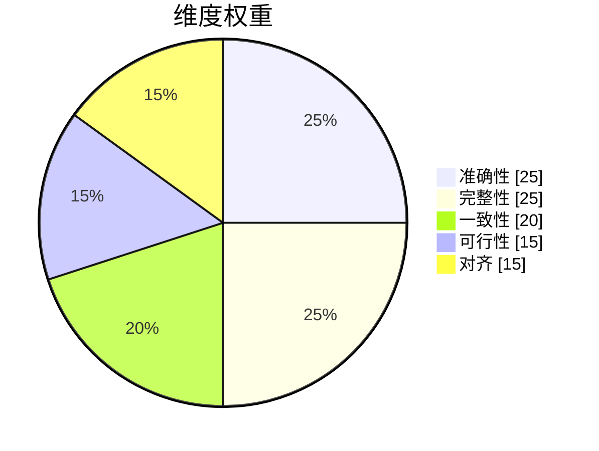

| 维度 | 权重 | 检查 |
|------|------|------|
| **准确性** | 25% | 规范是否正确反映需求? |
| **完整性** | 25% | 所有部分都填充? 测试覆盖 FR? |
| **一致性** | 20% | ID 有效? 无矛盾? |
| **可行性** | 15% | 技术上可行? 依赖存在? |
| **对齐** | 15% | 与堆栈和项目模式对齐? |

#### 判决逻辑

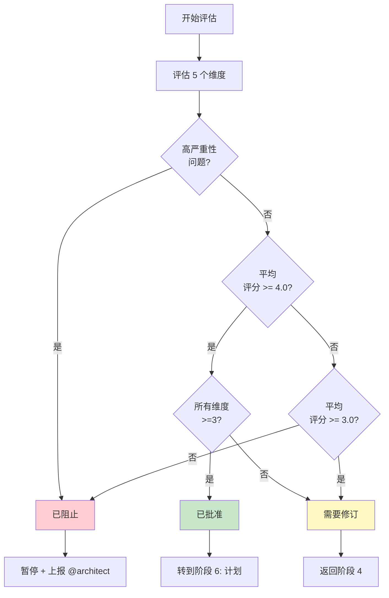

| 判决 | 条件 | 下一步 |
|------|------|--------|
| **已批准** | 无高问题，平均 >= 4.0，所有 >= 3 | 转到计划 |
| **需要修订** | 中问题或平均 3.0-3.9 | 返回规范编写 |
| **已阻止** | 高问题或平均 < 3.0 或任何 <= 1 | 上报给 @architect |

---

### 3.6 阶段 5b: 修订规范

| 属性 | 值 |
|------|-----|
| **步骤 ID** | `revise` |
| **阶段号** | 5b |
| **代理** | @pm (Morgan) |
| **条件** | `complexity.result === 'COMPLEX'` 或 `critique.verdict === 'NEEDS_REVISION'` |

#### 输入

| 输入 | 类型 | 必需 | 描述 |
|-----|------|------|------|
| `storyId` | 字符串 | 是 | 故事 ID |
| `spec` | 文件 | 是 | 当前 spec.md |
| `critique` | 文件 | 是 | 带反馈的 critique.json |

#### 输出

| 输出 | 位置 |
|-----|------|
| `spec.md` (已更新) | `docs/stories/{storyId}/spec/spec.md` |

---

### 3.7 阶段 5c: 第二次批评

| 属性 | 值 |
|------|-----|
| **步骤 ID** | `critique_2` |
| **阶段号** | 5c |
| **代理** | @qa (Quinn) |
| **任务** | `spec-critique.md` |
| **条件** | `complexity.result === 'COMPLEX'` |

> **注:** 如果有改进演示，第二次批评对中问题更宽松。

---

### 3.8 阶段 6: 创建实现计划

| 属性 | 值 |
|------|-----|
| **步骤 ID** | `plan` |
| **阶段号** | 6 |
| **代理** | @architect (Aria) |
| **任务** | `plan-create-implementation.md` |
| **条件** | `critique.verdict === 'APPROVED'` |

#### 输入

| 输入 | 类型 | 必需 | 描述 |
|-----|------|------|------|
| `storyId` | 字符串 | 是 | 故事 ID |
| `spec` | 文件 | 是 | 已批准的 spec.md |
| `complexity` | 文件 | 否 | complexity.json |

#### 输出

| 输出 | 位置 |
|-----|------|
| `implementation.yaml` | `docs/stories/{storyId}/plan/implementation.yaml` |

#### 子任务规则

| 规则 | 描述 |
|------|------|
| **单一服务** | 每个子任务 1 个服务 (前端、后端、数据库、基础设施) |
| **文件限制** | 每个子任务最多 3 个文件 |
| **需要验证** | 每个子任务必须定义验证 |
| **依赖顺序** | 数据库 > 后端 > 前端 > 集成 |

---

## 4. 参与的代理

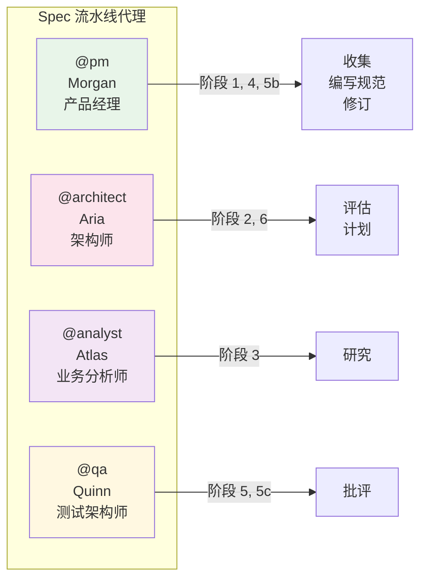

| 代理 | ID | 名字 | 流水线中的角色 | 阶段 |
|------|-----|------|-----------------|------|
| @pm | pm | Morgan | 产品经理 | 1 (收集), 4 (规范), 5b (修订) |
| @architect | architect | Aria | 系统架构师 | 2 (评估), 6 (计划) |
| @analyst | analyst | Atlas | 业务分析师 | 3 (研究) |
| @qa | qa | Quinn | 测试架构师 | 5 (批评), 5c (批评 2) |

### 4.1 档案: @pm (Morgan)

- **原型:** 战略家
- **焦点:** 需求收集、规范创建、文档
- **原则:** 以用户为中心、数据驱动、清晰精确
- **工具:** PRD 模板、结构化询问

### 4.2 档案: @architect (Aria)

- **原型:** 远见者
- **焦点:** 系统架构、技术评估、规划
- **原则:** 整体思考、实用选择、每层安全
- **工具:** Context7、EXA、代码库分析

### 4.3 档案: @analyst (Atlas)

- **原型:** 解码者
- **焦点:** 研究、市场分析、依赖验证
- **原则:** 好奇驱动、证据为基础、行动导向
- **工具:** EXA、Context7、Google Workspace

### 4.4 档案: @qa (Quinn)

- **原型:** 守护者
- **焦点:** 质量验证、批准网关、可追溯性
- **原则:** 需求可追溯性、风险基础测试、咨询卓越
- **工具:** CodeRabbit、浏览器测试、规范分析

---

## 5. 执行的任务

| 任务 | 阶段 | 代理 | 文件 |
|------|------|------|------|
| 收集需求 | 1 | @pm | `.aios-core/development/tasks/spec-gather-requirements.md` |
| 评估复杂性 | 2 | @architect | `.aios-core/development/tasks/spec-assess-complexity.md` |
| 研究依赖 | 3 | @analyst | `.aios-core/development/tasks/spec-research-dependencies.md` |
| 编写规范 | 4 | @pm | `.aios-core/development/tasks/spec-write-spec.md` |
| 批评规范 | 5, 5c | @qa | `.aios-core/development/tasks/spec-critique.md` |
| 创建实现计划 | 6 | @architect | `.aios-core/development/tasks/plan-create-implementation.md` |

---

## 6. 前置条件

### 6.1 飞行前检查

| 检查 | 描述 | 阻止 |
|------|------|------|
| `story_exists` | 故事目录存在或可创建 | 是 |
| `no_existing_spec` | 检查现有规范 (避免覆盖) | 否 (警告) |
| `agents_available` | 流水线代理已配置 | 是 |

### 6.2 必需的配置

```yaml
config:
  autoSpec:
    enabled: false        # 创建故事时启用自动规范
  showProgress: true      # 显示进度
  verbose: true           # 详细日志
  maxRetries: 2           # 失败时的重试次数
  retryDelay: 1000        # 重试之间的延迟 (毫秒)
  strictGate: true        # 已阻止暂停流水线
  outputDir: docs/stories/{storyId}/spec/
```

---

## 7. 输入和输出

### 7.1 流水线输入

| 输入 | 类型 | 描述 | 由谁提供 |
|-----|------|------|---------|
| `storyId` | 字符串 | 故事的唯一 ID | 用户 |
| `source` | 枚举 | `prd`、`user`、`existing` | 用户 (可选) |
| `prdPath` | 字符串 | 现有 PRD 的路径 | 用户 (可选) |
| `overrideComplexity` | 枚举 | 复杂性的手动覆盖 | 用户 (可选) |

### 7.2 流水线输出

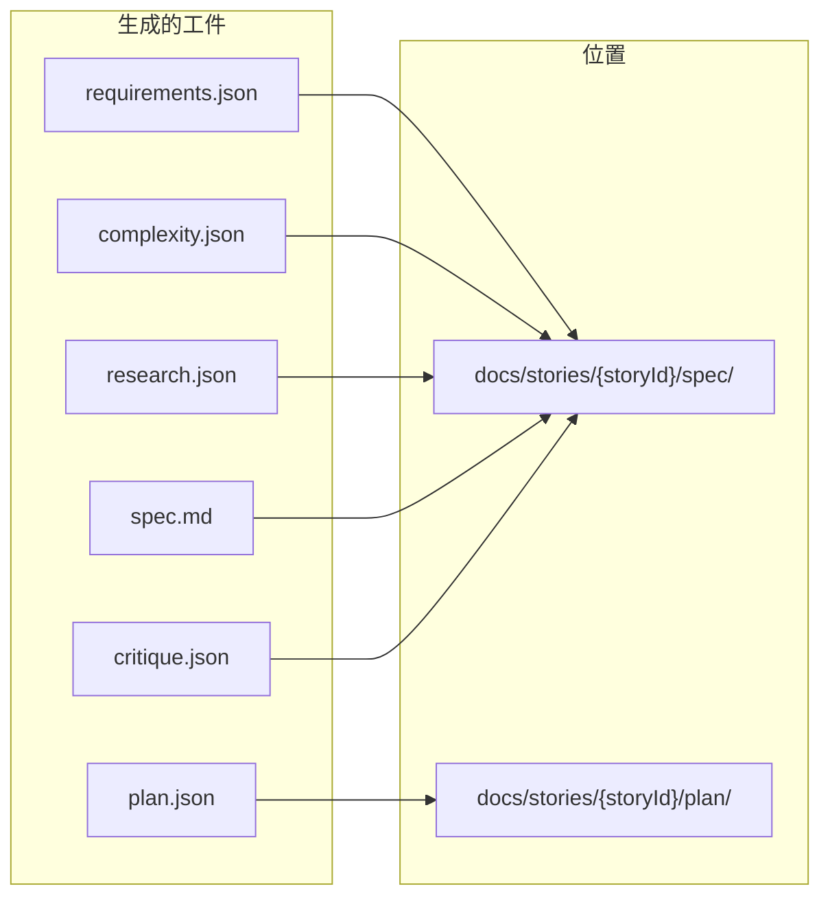

| 工件 | 阶段 | 描述 |
|------|------|------|
| `requirements.json` | 1 | 结构化需求 (9 个类别) |
| `complexity.json` | 2 | 复杂性评估 (5 个维度) |
| `research.json` | 3 | 已研究和验证的依赖 |
| `spec.md` | 4 | 完整的可执行规范 |
| `critique.json` | 5 | 质量评估的结果 |
| `plan.json` | 6 | 带子任务的实现计划 |

---

## 8. 决策点

### 8.1 决策: 跳过评估?

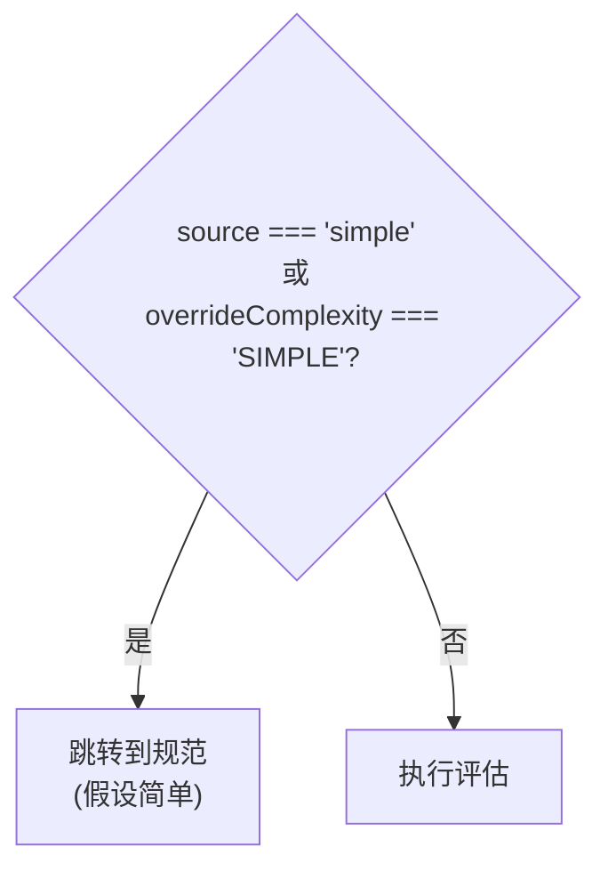

### 8.2 决策: 跳过研究?

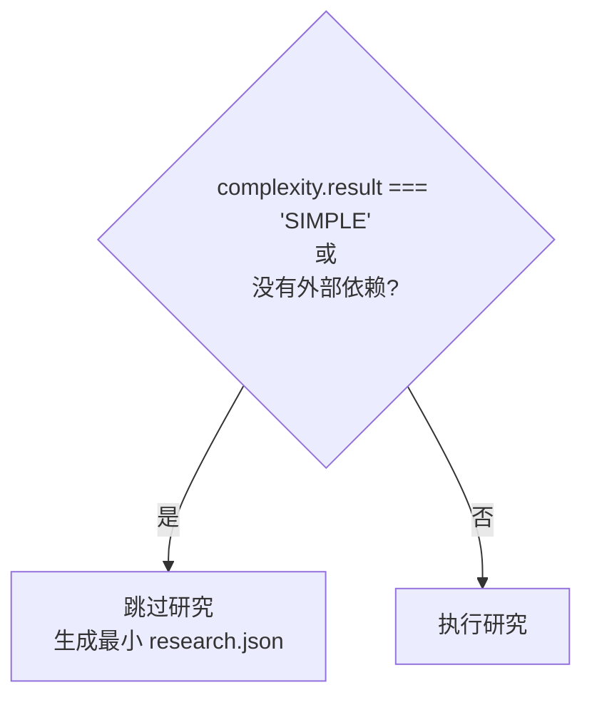

### 8.3 决策: 批评的判决

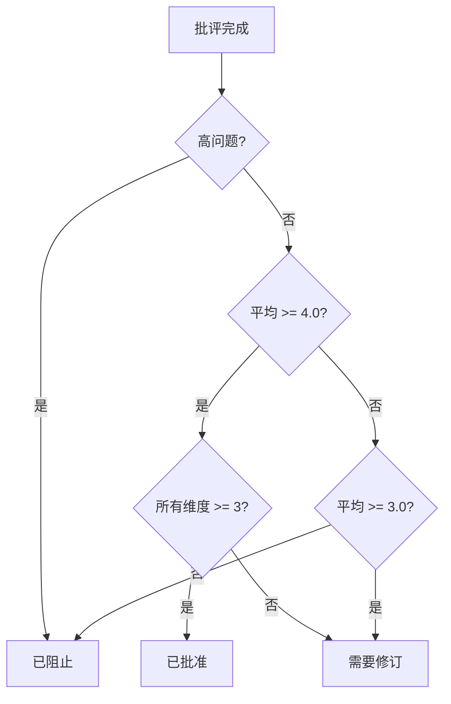

### 8.4 决策: 执行修订?

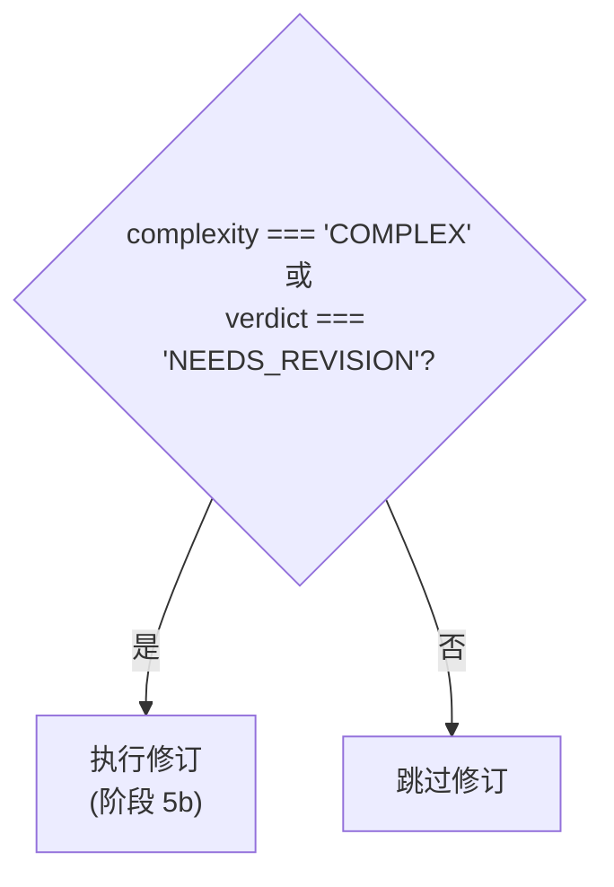

### 8.5 决策: 第二次批评?

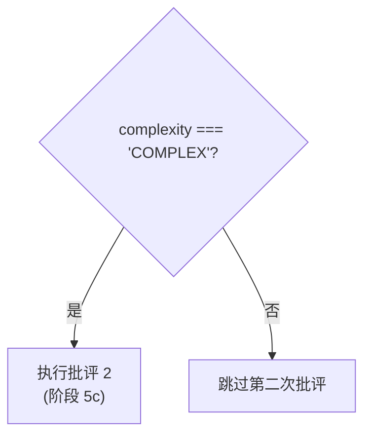

---

## 9. 故障排查

### 9.1 常见错误

| 错误 | 原因 | 解决方案 |
|------|------|---------|
| `missing_story_id` | 未提供故事 ID | `*create-spec 故事-42` |
| `phase_failed` | 阶段执行期间失败 | 检查日志，使用 `--resume` |
| `max_iterations_reached` | 达到修订限制 | 上报给 @architect |
| `critique_blocked` | 规范被 QA 网关阻止 | 审查 critique.json，修复高问题 |
| `missing-requirements` | 未找到 requirements.json | 先执行收集阶段 |
| `empty-functional` | 无函数式需求 | 重新执行询问 |
| `context7-unavailable` | Context7 MCP 无响应 | 使用 EXA 作为备用 |

### 9.2 如何恢复执行

流水线通过检查点支持恢复:

```yaml
resume:
  enabled: true
  state_file: docs/stories/{storyId}/spec/.pipeline-state.json

  checkpoints:
    - after: gather   -> requirements_gathered
    - after: assess   -> complexity_assessed
    - after: research -> research_complete
    - after: spec     -> spec_written
    - after: critique -> critique_complete
```

**恢复命令:**
```bash
*create-spec 故事-42 --resume
```

### 9.3 错误决策树

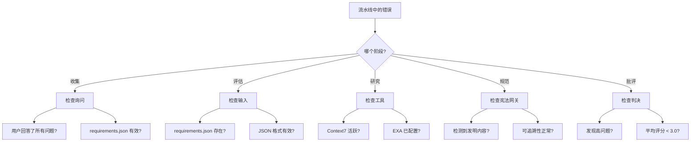

---

## 10. 参考

### 10.1 工作流文件

| 文件 | 位置 |
|------|------|
| 工作流定义 | `.aios-core/development/workflows/spec-pipeline.yaml` |
| 任务: 收集 | `.aios-core/development/tasks/spec-gather-requirements.md` |
| 任务: 评估 | `.aios-core/development/tasks/spec-assess-complexity.md` |
| 任务: 研究 | `.aios-core/development/tasks/spec-research-dependencies.md` |
| 任务: 编写规范 | `.aios-core/development/tasks/spec-write-spec.md` |
| 任务: 批评 | `.aios-core/development/tasks/spec-critique.md` |
| 任务: 创建计划 | `.aios-core/development/tasks/plan-create-implementation.md` |

### 10.2 相关代理

| 代理 | 位置 |
|------|------|
| @pm (Morgan) | `.aios-core/development/agents/pm.md` |
| @architect (Aria) | `.aios-core/development/agents/architect.md` |
| @analyst (Atlas) | `.aios-core/development/agents/analyst.md` |
| @qa (Quinn) | `.aios-core/development/agents/qa.md` |

### 10.3 相关文档

- [工作流 YAML 指南](../workflows-yaml-guide.md)
- [AIOS 文档索引](../AIOS-DOCUMENTATION-INDEX.md)
- [待办项管理系统](../BACKLOG-MANAGEMENT-SYSTEM.md)

### 10.4 快速命令

| 命令 | 描述 | 代理 |
|------|------|------|
| `*create-spec 故事-ID` | 执行完整流水线 | - |
| `*gather-requirements 故事-ID` | 仅收集阶段 | @pm |
| `*assess-complexity 故事-ID` | 仅评估阶段 | @architect |
| `*research-deps 故事-ID` | 仅研究阶段 | @analyst |
| `*write-spec 故事-ID` | 仅编写阶段 | @pm |
| `*critique-spec 故事-ID` | 仅批评阶段 | @qa |

---

## 11. 完成消息

成功完成时，流水线显示:

```
+==============================================================+
|  Spec 流水线完成                                             |
+==============================================================+

故事:       {storyId}
复杂性:      {简单|标准|复杂}
判决:        已批准
评分:        {评分}/5

工件:
   - docs/stories/{storyId}/spec/requirements.json
   - docs/stories/{storyId}/spec/complexity.json
   - docs/stories/{storyId}/spec/research.json
   - docs/stories/{storyId}/spec/spec.md
   - docs/stories/{storyId}/spec/critique.json

后续步骤:
   - 审查 spec.md
   - 运行 @dev *develop {storyId}
```

---

## 元数据

```yaml
metadata:
  documento: SPEC-PIPELINE-WORKFLOW.md
  versao: 1.0
  criado: 2026-02-04
  autor: 技术文档专家
  baseado_em:
    - .aios-core/development/workflows/spec-pipeline.yaml
    - .aios-core/development/tasks/spec-*.md
    - .aios-core/development/agents/*.md
  tags:
    - spec-pipeline
    - workflow
    - documentation
    - aios
    - auto-claude
```
