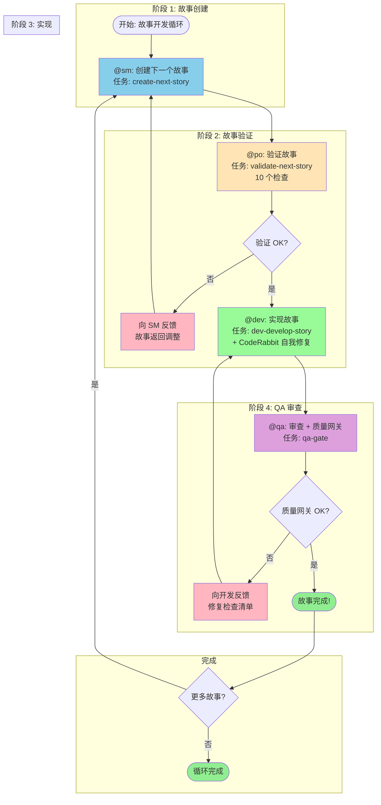
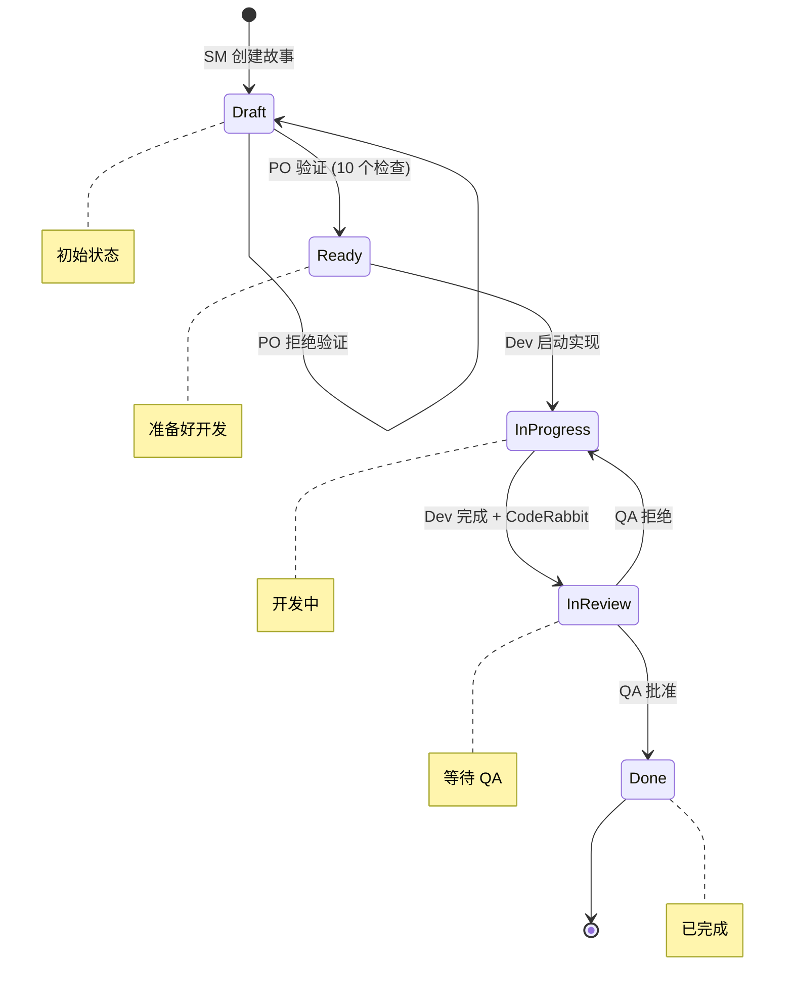
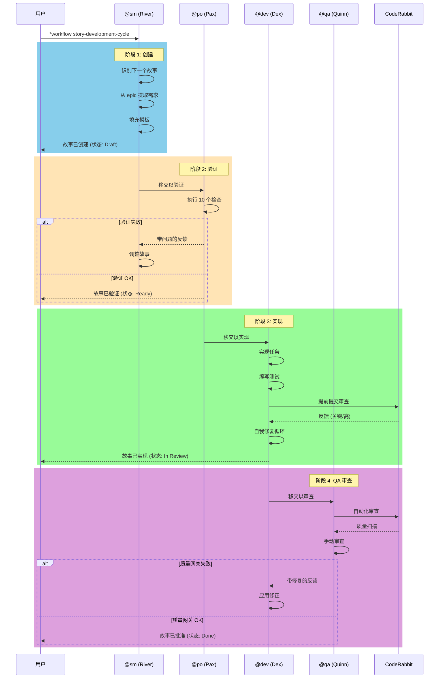
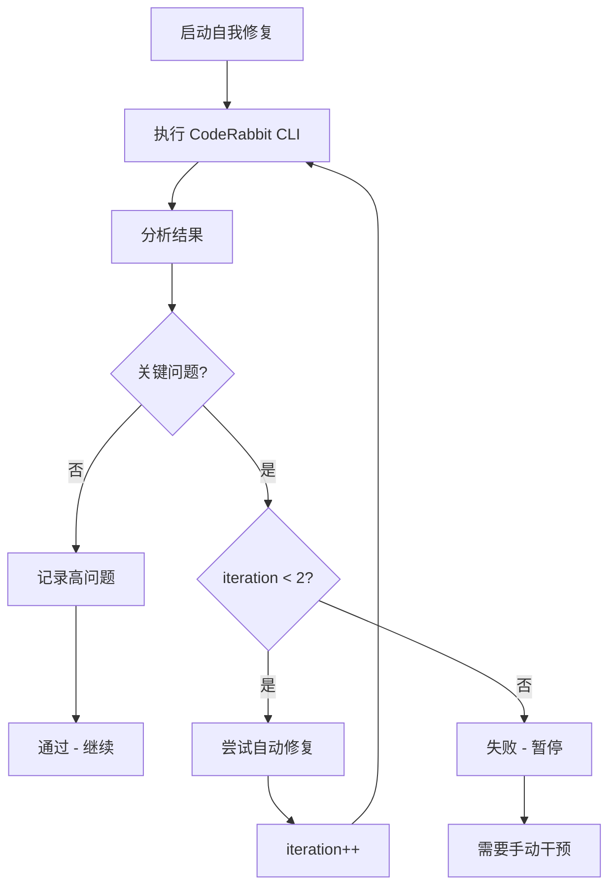
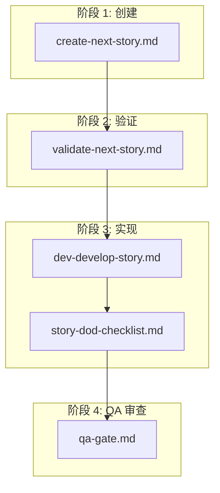
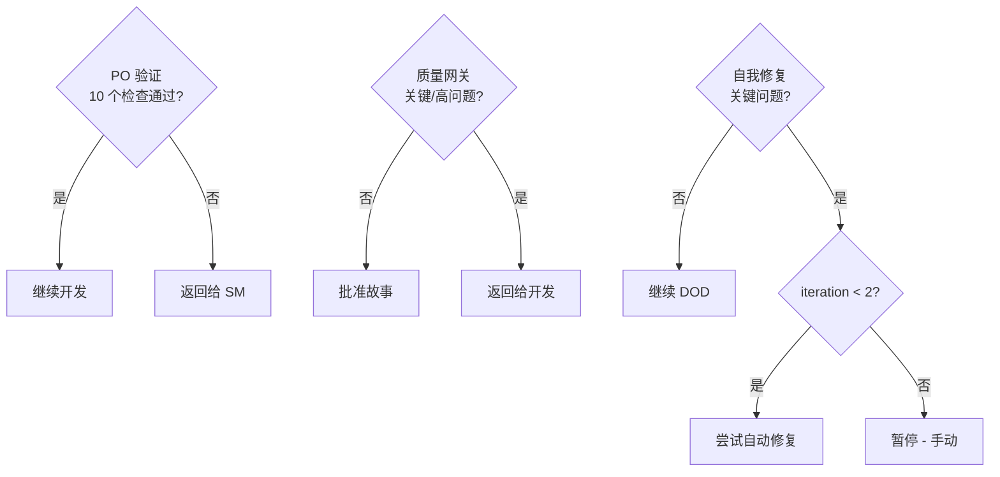

# 工作流: 故事开发循环

**版本:** 1.0
**类型:** 通用工作流
**作者:** Orion (AIOS 主机)
**创建日期:** 2025-01-30
**标签:** story、development-cycle、quality-gate、agile、generic

---

## 概览

**故事开发循环**是 AIOS 中央工作流，用于故事开发。它自动化从创建到交付的完整流程，整合质量网关，遵循序列: **创建 -> 验证 -> 实现 -> QA 审查**。

### 目标

确保每个故事通过结构化和可追踪的过程，在每个阶段进行验证点，减少返工并提高交付质量。

### 支持的项目类型

| 类型 | 描述 |
|------|------|
| `greenfield` | 新项目，从零开始 |
| `brownfield` | 现有项目，维护 |
| `feature-development` | 新功能开发 |
| `bug-fix` | Bug 修复 |
| `enhancement` | 现有功能改进 |

---

## 工作流 Mermaid 图

### 主流程



### 故事的状态流



### 代理之间的交互图



---

## 详细步骤

### 步骤 1: 创建故事 (阶段 1)

| 字段 | 值 |
|------|-----|
| **ID** | `create` |
| **代理** | @sm (River - Scrum Master) |
| **操作** | 创建下一个故事 |
| **任务** | `create-next-story.md` |

#### 描述

Scrum Master (River) 使用 PRD 共享或项目文档作为来源识别和创建下一个故事。

#### 输入

| 输入 | 类型 | 来源 | 必需 |
|-----|------|------|------|
| `name` | 字符串 | 用户输入 | 是 |
| `options` | 对象 | 用户输入 | 否 |
| `force` | 布尔 | 用户输入 | 否 |
| PRD 共享 | 文件 | 文件系统 | 是 |
| Epic 上下文 | 文档 | docs/stories/epic-X/ | 是 |

#### 输出

| 输出 | 类型 | 目标 |
|-----|------|------|
| `story_file` | 文件 | `{devStoryLocation}/{epicNum}.{storyNum}.story.md` |
| `story_id` | 字符串 | 工作流上下文 |
| `validation_report` | 对象 | 内存 |

#### 成功标准

- [ ] 故事创建，标题描述性强
- [ ] 验收标准已定义
- [ ] 范围清晰且明确
- [ ] 依赖已识别

#### 故事状态

- **之前:** 无
- **之后:** `Draft`

---

### 步骤 2: 验证故事 (阶段 2)

| 字段 | 值 |
|------|-----|
| **ID** | `validate` |
| **代理** | @po (Pax - 产品所有者) |
| **操作** | 验证故事 (10 个检查) |
| **任务** | `validate-next-story.md` |
| **要求** | `create` |

#### 描述

产品所有者 (Pax) 使用严格的 10 点检查清单验证已创建的故事，确保故事已准备好实现。

#### 输入

| 输入 | 类型 | 来源 | 必需 |
|-----|------|------|------|
| `story_file` | 文件 | 前一步的输出 | 是 |
| `target` | 字符串 | 用户输入 | 是 |
| `criteria` | 数组 | 配置 | 是 |
| `strict` | 布尔 | 用户输入 | 否 (默认: true) |

#### 输出

| 输出 | 类型 | 目标 |
|-----|------|------|
| `validation_report` | 对象 | 文件 (.ai/*.json) |
| `validation_result` | 布尔 | 返回值 |
| `errors` | 数组 | 内存 |
| `story_status` | 字符串 | 故事文件 |

#### 验证检查清单 (10 点)

| # | 检查 | 描述 |
|---|------|------|
| 1 | 标题清晰且目标明确 | 标题准确描述要做的事情 |
| 2 | 完整描述 | 问题/需求清楚说明 |
| 3 | 可测试的验收标准 | 偏好 Given/When/Then 格式 |
| 4 | 范围明确 | 哪些在范围内、哪些在范围外清晰列出 |
| 5 | 依赖已映射 | 已识别的前置故事或资源 |
| 6 | 复杂性估计 | 复杂性点数或 T-shirt 尺寸 |
| 7 | 商业价值 | 对用户/业务的好处清晰 |
| 8 | 已记录风险 | 已识别的潜在问题 |
| 9 | 完成标准 | 清晰定义完成时间 |
| 10 | 与 PRD/Epic 对齐 | 与源文档一致 |

#### 结果

| 结果 | 操作 |
|------|------|
| **已批准** | 状态变为 `Ready`，继续实现 |
| **已拒绝** | 返回给 SM 并带详细反馈 |

#### 故事状态

- **之前:** `Draft`
- **之后 (成功):** `Ready`
- **之后 (失败):** `Draft` (返回给 SM)

---

### 步骤 3: 实现故事 (阶段 3)

| 字段 | 值 |
|------|-----|
| **ID** | `implement` |
| **代理** | @dev (Dex - 全栈开发人员) |
| **操作** | 实现故事 |
| **任务** | `dev-develop-story.md` |
| **要求** | `validate` |

#### 描述

Dev Agent (Dex) 实现已验证的故事，遵循验收标准和定义的任务。包括 CodeRabbit 自我修复循环以确保代码质量。

#### 执行模式

| 模式 | 描述 | 向用户提示 |
|------|------|-----------|
| **YOLO** | 自主执行，带决策日志 | 0-1 |
| **Interactive** | 决策检查点和教育反馈 (默认) | 5-10 |
| **Pre-Flight** | 执行前完整规划 | 10-15 (提前) |

#### 输入

| 输入 | 类型 | 来源 | 必需 |
|-----|------|------|------|
| `story_file` | 文件 | 前一步的输出 | 是 |
| `task` | 字符串 | 用户输入 | 是 |
| `parameters` | 对象 | 用户输入 | 否 |
| `mode` | 字符串 | 用户输入 | 否 (默认: interactive) |

#### 输出

| 输出 | 类型 | 目标 |
|-----|------|------|
| `implementation_files` | 数组 | 文件系统 |
| `test_results` | 对象 | 控制台/日志 |
| `commit_hash` | 字符串 | Git |
| `execution_result` | 对象 | 内存 |
| `logs` | 数组 | `.ai/logs/*` |
| `decision_log` | 文件 | `.ai/decision-log-{story-id}.md` (YOLO 模式) |

#### 执行流程

```mermaid
flowchart LR
    A[读取任务] --> B[实现任务 + 子任务]
    B --> C[编写测试]
    C --> D[执行验证]
    D --> E{所有通过?}
    E -->|是| F[标记复选框 [x]]
    E -->|否| B
    F --> G[更新文件列表]
    G --> H{更多任务?}
    H -->|是| A
    H -->|否| I[CodeRabbit 自我修复]
    I --> J[故事 DOD 检查清单]
    J --> K[状态: In Review]
```

#### CodeRabbit 自我修复循环



#### 成功标准

- [ ] 所有验收标准已实现
- [ ] 测试通过
- [ ] 文件列表已更新
- [ ] 代码已提交
- [ ] CodeRabbit 自我修复已通过

#### 故事状态

- **之前:** `Ready`
- **期间:** `In Progress`
- **之后:** `In Review`

---

### 步骤 4: QA 审查 (阶段 4)

| 字段 | 值 |
|------|-----|
| **ID** | `review` |
| **代理** | @qa (Quinn - 测试架构师) |
| **操作** | 最终审查 + 质量网关 |
| **任务** | `qa-gate.md` |
| **要求** | `implement` |

#### 描述

QA Agent (Quinn) 执行最终审查和质量网关，验证代码、测试和验收标准的遵循。

#### 输入

| 输入 | 类型 | 来源 | 必需 |
|-----|------|------|------|
| `story_file` | 文件 | 前一步的输出 | 是 |
| `target` | 字符串 | 用户输入 | 是 |
| `criteria` | 数组 | 配置 | 是 |
| `strict` | 布尔 | 用户输入 | 否 (默认: true) |

#### 输出

| 输出 | 类型 | 目标 |
|-----|------|------|
| `qa_report` | 文件 | `{qaLocation}/gates/{epic}.{story}-{slug}.yml` |
| `quality_gate_status` | 字符串 | 通过/关切/失败/放弃 |
| `story_final_status` | 字符串 | 故事文件 |
| `validation_result` | 布尔 | 返回值 |
| `errors` | 数组 | 内存 |

#### 质量网关检查

| # | 检查 | 描述 |
|---|------|------|
| 1 | 代码审查 | 模式、可读性、可维护性 |
| 2 | 单元测试 | 适当且通过 |
| 3 | 验收标准 | 所有都得到满足 |
| 4 | 无回归 | 现有功能已保留 |
| 5 | 性能 | 在可接受的限制范围内 |
| 6 | 安全 | OWASP 基础已验证 |
| 7 | 文档 | 必要时已更新 |

#### 质量网关决策

| 决策 | 标准 | 操作 |
|------|------|------|
| **通过** | 所有检查通过，无高问题 | 批准故事 |
| **关切** | 存在非阻止问题 | 带观察批准 |
| **失败** | 存在高/关键问题 | 返回给开发 |
| **放弃** | 明确接受问题 | 带放弃批准 |

#### 问题严重性

| 严重性 | 描述 | 操作 |
|--------|------|------|
| `low` | 次要、化妆问题 | 记录 |
| `medium` | 应尽快修复 | 创建技术债 |
| `high` | 关键，应阻止发布 | 返回给开发 |

#### 结果

| 结果 | 操作 |
|------|------|
| **已批准** | 状态变为 `Done` |
| **已拒绝** | 返回给开发并带修复检查清单 |

#### 故事状态

- **之前:** `In Review`
- **之后 (成功):** `Done`
- **之后 (失败):** `In Progress` (返回给开发)

---

## 参与的代理

### @sm - River (Scrum Master)

| 方面 | 描述 |
|------|------|
| **图标** | 🌊 |
| **原型** | 协调者 |
| **角色** | 技术 Scrum Master - 故事准备专家 |
| **焦点** | 为开发代理创建清晰且可行的故事 |
| **责任** | 故事创建、epic 管理、冲刺规划、本地分支管理 |

**相关命令:**
- `*draft` - 创建下一个故事
- `*story-checklist` - 执行故事检查清单

---

### @po - Pax (产品所有者)

| 方面 | 描述 |
|------|------|
| **图标** | 🎯 |
| **原型** | 平衡者 |
| **角色** | 技术产品所有者和流程监管者 |
| **焦点** | 验证工件的内聚性并确保文档质量 |
| **责任** | 待办项管理、故事验证、优先化、PM 工具同步 |

**相关命令:**
- `*validate-story-draft {story}` - 验证故事质量
- `*backlog-review` - 冲刺规划审查

---

### @dev - Dex (全栈开发人员)

| 方面 | 描述 |
|------|------|
| **图标** | 💻 |
| **原型** | 构造者 |
| **角色** | 专业高级软件工程师和实现专家 |
| **焦点** | 精确执行故事任务和全面测试 |
| **责任** | 代码实现、测试、调试、重构 |

**相关命令:**
- `*develop {story-id}` - 实现故事
- `*run-tests` - 执行检查和测试
- `*apply-qa-fixes` - 应用 QA 修复

---

### @qa - Quinn (测试架构师)

| 方面 | 描述 |
|------|------|
| **图标** | ✅ |
| **原型** | 守护者 |
| **角色** | 带质量咨询权限的测试架构师 |
| **焦点** | 通过测试架构进行全面的质量分析 |
| **责任** | 代码审查、质量网关、测试策略、风险评估 |

**相关命令:**
- `*review {story}` - 全面审查故事
- `*gate {story}` - 创建质量网关决策
- `*code-review {scope}` - 自动化审查

---

## 执行的任务

### 按阶段的任务映射



### 任务详细说明

| 任务 | 文件 | 代理 | 目的 |
|------|------|------|------|
| 创建下一个故事 | `create-next-story.md` | @sm | 从 PRD/epic 创建故事 |
| 验证下一个故事 | `validate-next-story.md` | @po | 验证完整性和质量 |
| 开发故事 | `dev-develop-story.md` | @dev | 实现代码和测试 |
| 故事 DOD 检查清单 | `story-dod-checklist.md` | @dev | 检查完成的定义 |
| QA 网关 | `qa-gate.md` | @qa | 创建质量网关决策 |

---

## 前置条件

### 项目配置

1. **core-config.yaml** - 必需的 AIOS 配置文件
   - `devStoryLocation` - 故事位置
   - `prd.*` - PRD 配置
   - `architecture.*` - 架构配置
   - `qa.qaLocation` - QA 工件位置

2. **故事模板** - `.aios-core/development/templates/` 中的 `story-tmpl.yaml`

3. **检查清单** - 必需的可用检查清单:
   - `story-draft-checklist.md`
   - `story-dod-checklist.md`
   - `po-master-checklist.md`

### 必需的文档

| 文档 | 位置 | 必需 |
|------|------|------|
| PRD (共享或整体) | 按 `prd.*` 配置 | 是 |
| Epic 文件 | `docs/stories/epic-X/` | 是 |
| 架构文档 | 按 `architecture.*` 配置 | 是 |

### 集成的工具

| 工具 | 目的 | 代理 |
|------|------|------|
| `git` | 版本控制 | @sm, @dev, @qa |
| `coderabbit` | 自动化审查 | @dev, @qa |
| `clickup` | 故事追踪 | @sm, @po |
| `context7` | 库文档 | 所有 |
| `github-cli` | GitHub 操作 | @po, @qa |

---

## 输入和输出

### 工作流输入

| 输入 | 类型 | 来源 | 描述 |
|------|------|------|------|
| Epic 需求 | 文档 | `docs/stories/epic-X/` | Epic 需求 |
| PRD | 文档 | 按配置 | 产品需求 |
| 架构文档 | 文档 | `docs/architecture/` | 技术规范 |
| 故事模板 | YAML | `.aios-core/development/templates/` | 标准模板 |

### 工作流输出

| 输出 | 类型 | 目标 | 描述 |
|-----|------|------|------|
| 故事文件 | Markdown | `{devStoryLocation}/{epic}.{story}.story.md` | 完整故事 |
| 实现文件 | 代码 | 按故事任务 | 已实现代码 |
| 测试文件 | 代码 | 按项目模式 | 单元测试 |
| QA 网关文件 | YAML | `{qaLocation}/gates/{epic}.{story}-{slug}.yml` | QA 决策 |
| 决策日志 | Markdown | `.ai/decision-log-{story-id}.md` | 决策日志 (YOLO 模式) |

---

## 决策点

### 决策图



### 详细的决策点

| 点 | 阶段 | 决策者 | 标准 | 积极结果 | 消极结果 |
|-----|------|--------|------|---------|---------|
| PO 验证 | 2 | @po | 10 个检查通过 | 状态: 就绪 | 返回给 SM |
| 自我修复 | 3 | 系统 | 无关键问题 | 继续 DOD | 暂停或自动修复 |
| 质量网关 | 4 | @qa | 无高/关键 | 状态: 完成 | 返回给开发 |

### 阻止条件

工作流应暂停并请求用户干预时:

1. **所需的未批准依赖** - 需要新库或资源
2. **验证后的歧义** - 需求不清晰
3. **3 次连续失败** - 实现或修正尝试
4. **缺少配置** - core-config.yaml 或模板缺失
5. **回归测试失败** - 现有测试破损

---

## 执行模式

工作流支持影响所有步骤的三种执行模式:

### 1. YOLO 模式 (自主)

```yaml
mode: yolo
prompts: 0-1
best_for: 简单且确定的任务
```

- 自主决策，带自动日志
- 最少用户交互
- 生成 `decision-log-{story-id}.md`，包含所有决策

### 2. Interactive 模式 (平衡) [默认]

```yaml
mode: interactive
prompts: 5-10
best_for: 学习和复杂决策
```

- 显式决策检查点
- 每个步骤的教育说明
- 确认用户理解

### 3. Pre-Flight 模式 (规划)

```yaml
mode: preflight
prompts: 10-15 (提前)
best_for: 模糊需求和关键工作
```

- 开始前的完整歧义分析
- 全面的提前问卷
- 执行后无歧义

---

## 故障排查

### 常见问题

#### 1. 无法创建故事

**症状:** 执行 `create-next-story` 时错误

**可能原因:**
- 未找到 `core-config.yaml`
- Epic 文件不存在
- PRD 不可用

**解决方案:**
```bash
# 检查 core-config.yaml 存在
cat .aios-core/core-config.yaml

# 检查 epic 结构
ls docs/stories/epic-*/

# 检查 PRD
cat docs/prd/PRD.md  # 或按配置定位
```

#### 2. PO 验证重复失败

**症状:** 故事多次返回给 SM

**可能原因:**
- 验收标准定义不良
- 开发备注中缺少信息
- 范围不清晰

**解决方案:**
1. 审查 10 个检查清单
2. 确保验收标准为 Given/When/Then 格式
3. 用架构参考填充开发备注

#### 3. CodeRabbit 自我修复失败

**症状:** 关键问题在 2 次迭代后仍然存在

**可能原因:**
- 需要重大重构的问题
- 复杂安全问题
- 违反架构模式的代码

**解决方案:**
```bash
# 检查 CodeRabbit 输出
wsl bash -c 'cd ${PROJECT_ROOT} && ~/.local/bin/coderabbit --prompt-only -t uncommitted'

# 手动修正问题
# 然后重新执行 *develop
```

#### 4. 质量网关返回失败

**症状:** QA 拒绝带高问题的故事

**可能原因:**
- 验收标准未得到满足
- 测试覆盖不足
- 安全问题

**解决方案:**
1. 审查生成的 `{qaLocation}/gates/{epic}.{story}-{slug}.yml`
2. 在 @dev 上执行 `*apply-qa-fixes`
3. 重新提交以审查

#### 5. 工作流在切换时卡住

**症状:** 代理之间的转换不发生

**可能原因:**
- 输出生成不正确
- 故事状态不一致
- 前一步的依赖不满足

**解决方案:**
```bash
# 检查故事状态
cat docs/stories/{story-file}.md | grep "status:"

# 强制手动转换
@{next-agent}
*{appropriate-command}
```

### 日志和诊断

| 文件 | 位置 | 内容 |
|------|------|------|
| 决策日志 | `.ai/decision-log-{story-id}.md` | 自主决策 (YOLO 模式) |
| QA 网关 | `{qaLocation}/gates/{epic}.{story}-{slug}.yml` | 网关决策 |
| 故事文件 | `{devStoryLocation}/{epic}.{story}.story.md` | 完整历史，带日志 |

---

## 何时使用及何时不使用

### 何时使用此工作流

- 任何故事的开发 (greenfield 或 brownfield)
- 当需要完整循环且验证和质量网关
- 当需要过程的可追溯性
- 遵循结构化敏捷过程的团队

### 何时不使用此工作流

| 情况 | 替代方案 |
|------|---------|
| 紧急的热修复 | 简化流程，不包括 QA 网关 |
| 探索性 spike/POC | 临时开发 |
| 纯技术任务无故事 | 与 @dev 的直接任务 |

---

## 参考

### 相关文件

| 文件 | 路径 |
|------|------|
| 工作流定义 | `.aios-core/development/workflows/story-development-cycle.yaml` |
| SM 代理 | `.aios-core/development/agents/sm.md` |
| PO 代理 | `.aios-core/development/agents/po.md` |
| 开发代理 | `.aios-core/development/agents/dev.md` |
| QA 代理 | `.aios-core/development/agents/qa.md` |
| 创建故事任务 | `.aios-core/development/tasks/create-next-story.md` |
| 验证故事任务 | `.aios-core/development/tasks/validate-next-story.md` |
| 开发故事任务 | `.aios-core/development/tasks/dev-develop-story.md` |
| QA 网关任务 | `.aios-core/development/tasks/qa-gate.md` |
| 故事模板 | `.aios-core/development/templates/story-tmpl.yaml` |

### 附加文档

- [工作流 YAML 指南](../workflows-yaml-guide.md)
- [Squad 用户指南](../squads-user-guide.md)
- [优先化框架](../PRIORITIZATION-FRAMEWORK.md)

---

## 变更日志

| 版本 | 日期 | 更改 |
|------|------|------|
| 1.0 | 2025-01-30 | 工作流初始版本 |

---

*文档自动基于 `story-development-cycle.yaml` 文件生成*
