# AIOS — 可视化概览与流程图

> 高级可视化指南，解释什么是 Synkra AIOS，
> Task-First 方法论，4 种执行器类型，
> 动态工作空间以及它们如何相互连接。

**版本:** 1.0.0
**日期:** 2026-02-12
**作者:** @architect (Aria)
**状态:** 持续更新文档

---

## 目录

1. [什么是 AIOS？](#1-什么是-aios)
2. [Task-First 理念](#2-task-first-理念)
3. [4 种执行器](#3-4-种执行器)
4. [决策树 — 使用哪种执行器？](#4-决策树--使用哪种执行器)
5. [动态工作空间](#5-动态工作空间)
6. [完整流程 — 从创意到部署](#6-完整流程--从创意到部署)
7. [对比总结](#7-对比总结)

---

## 1. 什么是 AIOS？

**Synkra AIOS** (AI Operating System) 是一个框架，它改变了团队构建软件的方式 — 将 **专业化 AI 代理** 与 **真实人类** 结合在一种独特的敏捷方法论中。

核心创新: **任务是主要单位，而非代理。**
代理只是执行任务的 4 种可能执行器类型之一。

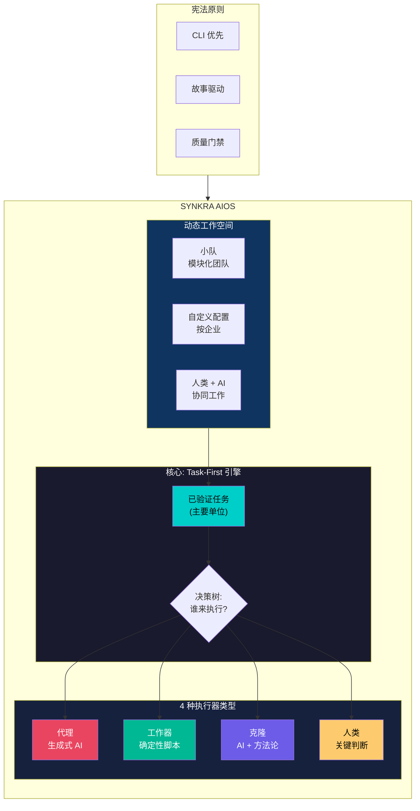

### 一句话概括 AIOS

> **"一个用于软件开发的操作系统，其中已验证的任务由最理想的执行器执行 — 无论是 AI、脚本、认知克隆还是人类 — 在按企业定制的动态工作空间中运行。"**

### 优先级层次

```
CLI 优先  >  可观测性次之  >  UI 第三
(执行)       (监控)          (临时管理)
```

---

## 2. Task-First 理念

Pedro Valerio 的 **Task-First** 方法论颠覆了传统范式:

| 传统范式 | Task-First (AIOS) |
|-----------------------|-------------------|
| 代理是中心 | **任务** 是中心 |
| "我使用哪个代理？" | "我需要执行什么任务？" |
| 代理决定做什么 | 任务定义做什么，执行器定义谁来做 |
| 与执行器耦合 | 执行器是 **可互换的** |

### 核心原则

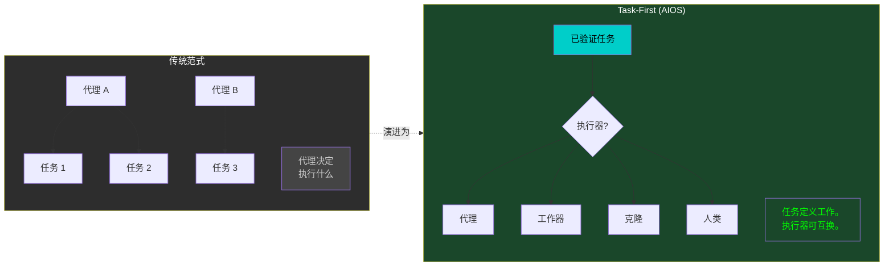

### 任务解剖

已验证的任务是 **法律** — 必须按照定义执行，无论谁（或什么）来执行它:

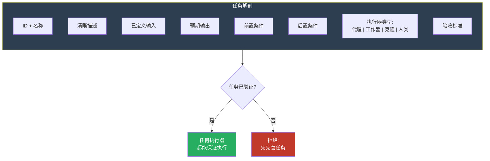

### 为什么选择 Task-First？

```
一个定义良好的任务可以由以下执行:
  - 凌晨3点的 AI 代理               (代理)
  - 在 CI/CD 中运行的脚本            (工作器)
  - Brad Frost 的克隆进行验证        (克隆)
  - 人类手动审核                     (人类)

结果是相同的。执行器是可互换的。
```

---

## 3. 4 种执行器

每种执行器都有独特的特性，使其适合特定类型的任务:

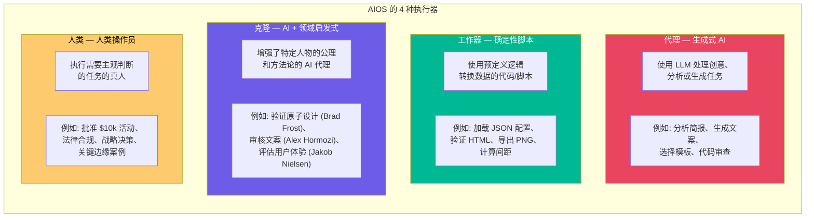

### 快速对比

| | 代理 | 工作器 | 克隆 | 人类 |
|---|---|---|---|---|
| **成本** | $$$$ | $ | $$$$ | $$$ |
| **速度** | 3-10秒 | < 1秒 | 5-15秒 | 分钟-小时 |
| **确定性** | 否 | 是 | 部分 | 否 |
| **创造力** | 是 | 否 | 是 (有引导) | 是 |
| **法律责任** | 否 | 否 | 否 | 是 |
| **最适合** | 创意任务 | 转换 | 方法论验证 | 关键决策 |

---

## 4. 决策树 — 使用哪种执行器？

这是决定 AIOS 中每个任务应分配哪个执行器的主要流程图:

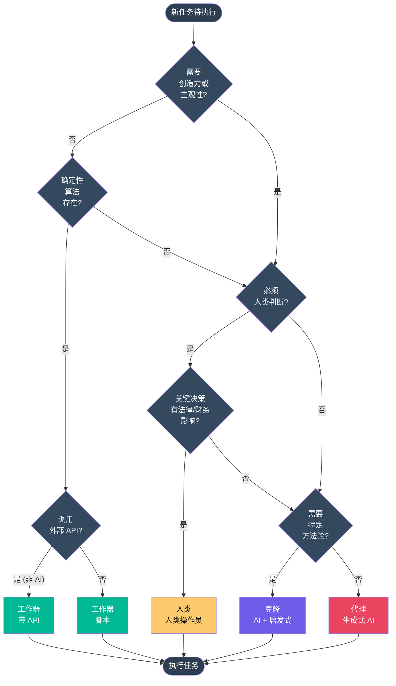

### 替换规则

随着系统演进，执行器可以随时间更换:

```mermaid
flowchart LR
    subgraph SUBSTITUTION["执行器替换规则"]
        direction TB

        R1["代理 -> 工作器<br/><i>当任务变得<br/>数据确定性</i>"]
        R2["人类 -> 代理<br/><i>当自动化达到<br/>可接受精度</i>"]
        R3["代理 -> 克隆<br/><i>当特定方法论<br/>提高质量</i>"]
        R4["克隆 -> 代理<br/><i>当方法论对<br/>结果不关键</i>"]
    end

    R1 -->|"节省: 100%"| SAVE1["$$$ -> $"]
    R2 -->|"节省: 99.8%"| SAVE2["$$$ -> $"]
    R3 -->|"质量: +25%"| QUAL1["+成本, +质量"]
    R4 -->|"节省: 67%"| SAVE3["$$$$ -> $$"]

    style R1 fill:#00b894,color:#fff
    style R2 fill:#e94560,color:#fff
    style R3 fill:#6c5ce7,color:#fff
    style R4 fill:#e94560,color:#fff
```

### 混合策略

在实践中，许多任务结合执行器以获得最佳结果:

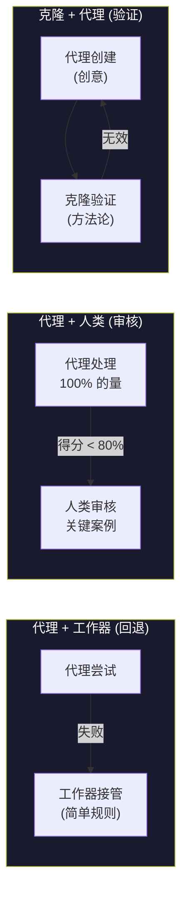

---

## 5. 动态工作空间

每个公司/团队使用其所需的组件组装自己的 **定制工作空间**。
AIOS 是模块化的 — 你像乐高积木一样组合小队、代理和配置。

### 工作空间架构

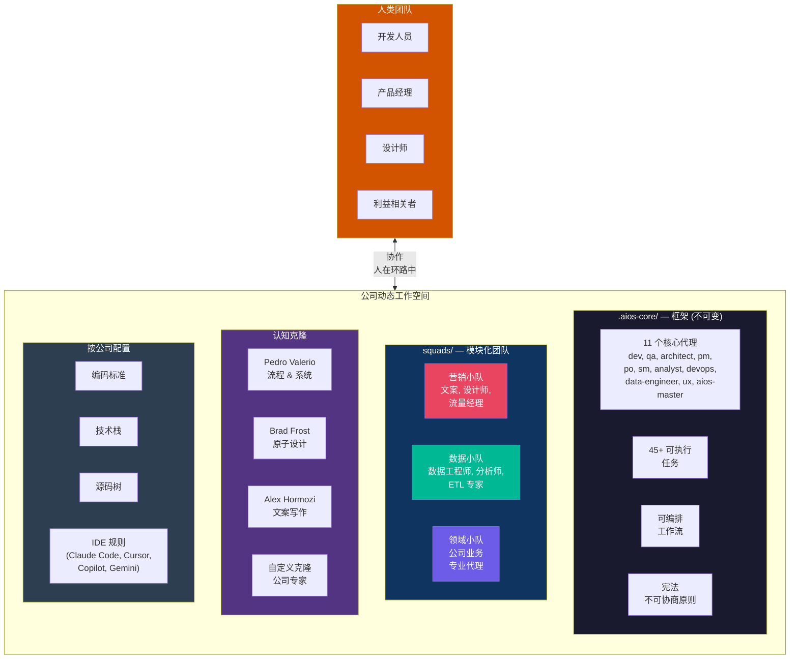

### 公司如何组装其工作空间

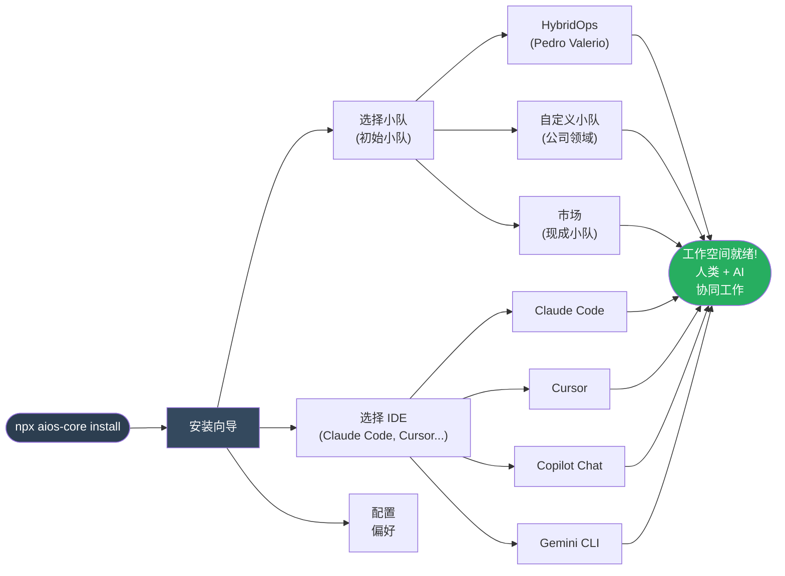

### 小队 + 人类: 真正的协作

AIOS 的差异化在于小队 **不会取代** 人类 — 它们 **一起** 工作:

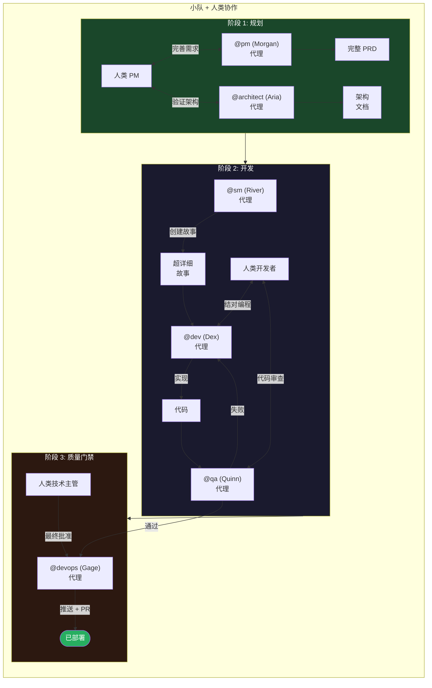

---

## 6. 完整流程 — 从创意到部署

此图显示了从创意到部署的完整路径，经过所有代理、门禁和决策点:

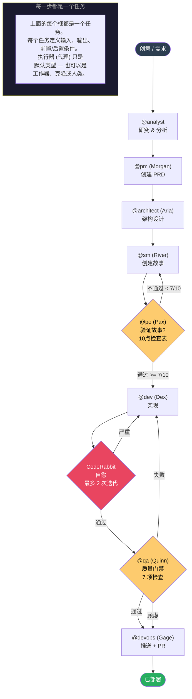

### 各阶段执行器映射

| 阶段 | 任务 | 默认执行器 | 可能替代 |
|------|------|-----------------|---------------------|
| 研究 | 市场分析 | 代理 (@analyst) | 人类 (研究员) |
| 规划 | 创建 PRD | 代理 (@pm) | 人类 (真实 PM) |
| 架构 | 系统设计 | 代理 (@architect) | 人类 (CTO) |
| 故事 | 创建故事 | 代理 (@sm) | 人类 (真实 SM) |
| 验证 | 验证故事 | 代理 (@po) | 人类 (真实 PO) |
| 实现 | 编码功能 | 代理 (@dev) | 人类 (真实开发者) |
| QA | 质量门禁 | 代理 (@qa) | 人类 (真实 QA) |
| 部署 | 推送 + PR | 代理 (@devops) | 人类 (真实 DevOps) |
| 代码检查 | 验证风格 | **工作器** (ESLint) | — |
| 类型检查 | 验证类型 | **工作器** (TypeScript) | — |
| 构建 | 编译项目 | **工作器** (npm build) | — |
| 设计审查 | 验证原子设计 | **克隆** (Brad Frost) | 人类 (高级设计师) |
| 文案审查 | 验证文案 | **克隆** (Hormozi) | 人类 (文案撰稿人) |
| 法律审批 | 合规检查 | **人类** (必须) | — |
| 财务审批 | 预算 > $10k | **人类** (必须) | — |

---

## 7. 对比总结

### AIOS vs 传统方法

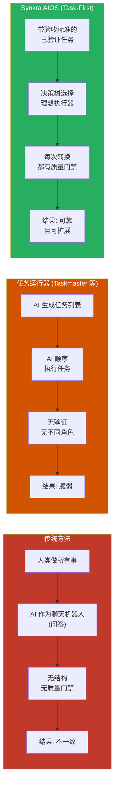

### 宪法原则

AIOS 在具有不可协商原则的 **正式宪法** 下运行:

| 条款 | 原则 | 严重性 | 含义 |
|--------|-----------|------------|-------------|
| I | CLI 优先 | 不可协商 | 所有功能在任何 UI 之前先通过 CLI 工作 |
| II | 代理权限 | 不可协商 | 每个代理拥有独占权限 |
| III | 故事驱动 | 必须 | 所有开发从故事开始 |
| IV | 禁止发明 | 必须 | 规格源自需求，从不发明 |
| V | 质量优先 | 必须 | 质量门禁阻止糟糕代码 |
| VI | 绝对导入 | 应该 | 始终使用绝对导入 |

---

## 如何查看这些图表

流程图使用 **Mermaid**，可在以下位置渲染:

1. **GitHub** — 自动在 `.md` 文件中渲染
2. **VS Code** — 扩展 "Markdown Preview Mermaid Support"
3. **Mermaid 在线编辑器** — [mermaid.live](https://mermaid.live)
4. **Obsidian** — 原生支持 Mermaid

---

## 相关文档

| 文档 | 内容 |
|-----------|----------|
| [EXECUTOR-DECISION-TREE.md](../../.aios-core/docs/standards/EXECUTOR-DECISION-TREE.md) | 带示例和成本效益分析的详细决策树 |
| [SYNAPSE-FLOWCHARTS.md](SYNAPSE/SYNAPSE-FLOWCHARTS.md) | SYNAPSE 上下文引擎的 12 个流程图 |
| [Constitution](../../.aios-core/constitution.md) | 框架的不可协商原则 |
| [User Guide](../../.aios-core/user-guide.md) | AIOS 使用完整指南 |
| [Squads Guide](../guides/squads-guide.md) | 如何创建和管理小队 |

---

*Synkra AIOS 可视化概览 v1.0.0*
*Task-First | 4 种执行器 | 动态工作空间*
*— Aria，架构未来*
