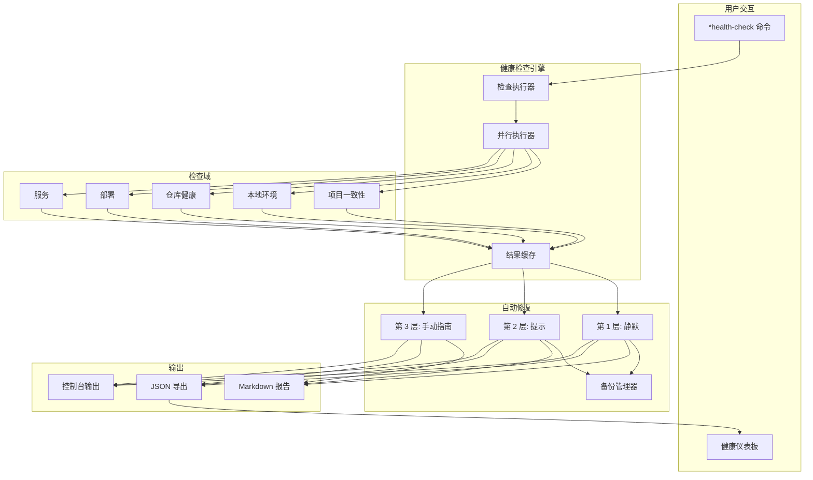
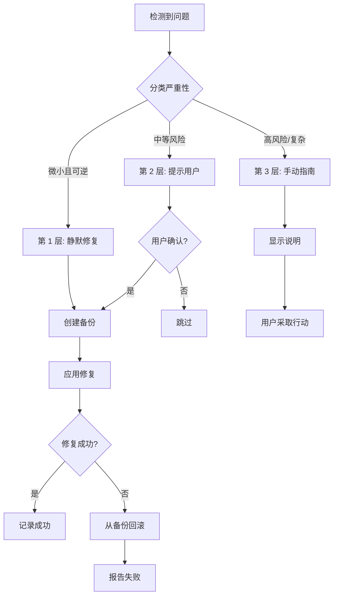
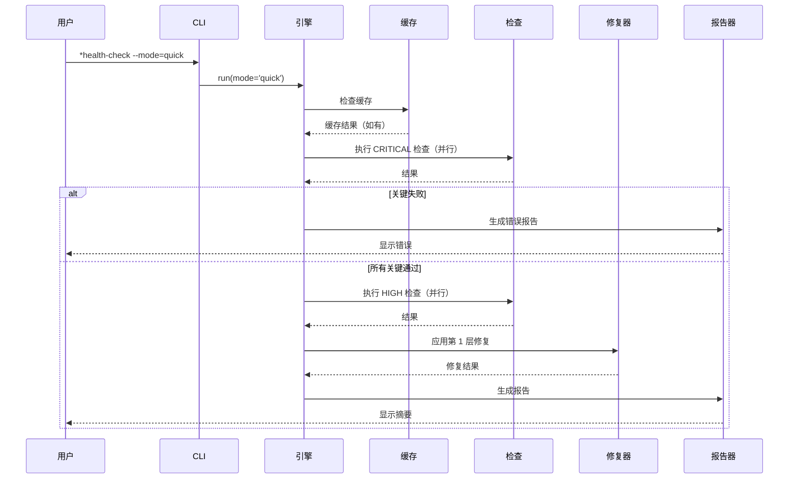

<!-- 翻译: zh-CN | 原文: /docs/architecture/adr/adr-hcs-health-check-system.md | 同步日期: 2026-02-22 -->

# ADR: 健康检查系统架构

**ADR ID:** ADR-HCS-001
**状态:** 提议
**创建日期:** 2025-12-30
**作者:** @architect (Aria) 通过 @dev (Dex)
**Story:** HCS-1 调研
**决策者:** @architect、@po、技术负责人

---

## 背景

AIOS 需要一个全面的健康检查系统，用于：

1. **诊断问题** - 项目配置、环境和集成
2. **启用自动修复** - 无需手动干预修复常见问题
3. **跟踪技术债务** - 识别降级状态
4. **提供可见性** - 通过仪表板了解整体项目健康状况
5. **CI/CD 集成** - 持续健康监控

### 问题陈述

目前，开发者需要在多个领域手动诊断问题：

- 框架配置漂移
- 环境配置错误
- MCP 集成损坏
- 具有安全漏洞的过时依赖
- IDE 配置不一致

这导致：

- 调试浪费时间
- 团队间开发环境不一致
- 静默失败后来表现为 bug
- 安全漏洞未被发现

### 需求

1. **执行模式:** 手动、CI 定时、合并后、IDE 后台可选
2. **检查域:** 项目一致性、本地环境、仓库、部署、服务
3. **自动修复:** 分层方法（静默、提示、手动指南）
4. **性能:** 快速模式 <10s，完整模式 <60s
5. **可扩展性:** 支持项目特定的自定义检查
6. **集成:** 复用 Story 3.11 质量仪表板组件

---

## 决策

我们将实现一个**混合健康检查系统**，具有以下架构：

### 核心架构决策

#### 1. 执行模型: 手动优先 + CI 集成

**决策:** 主要执行是手动（`*health-check` 命令），次要是定时 CI 集成。

**理由:**

- 遵循行业模式（Flutter doctor、Homebrew doctor、WP-CLI doctor）
- 避免 pre-commit hooks 的工作流摩擦
- Terraform 模式：检测与修复分离
- Kubernetes 模式：后台持续监控

**拒绝的替代方案:**

- Pre-commit hooks：太慢（10-30s），开发者会用 `--no-verify` 跳过
- 始终后台运行：复杂，性能问题
- 仅 CI：对开发者无即时反馈

#### 2. 检查架构: 混合（代码 + YAML）

**决策:** 使用基于代码的检查实现核心功能，基于 YAML 的检查实现可扩展性。

**理由:**

- 代码提供性能和复杂逻辑能力
- YAML 提供简单的项目特定自定义
- WP-CLI 模式：核心检查 + `doctor.yml` 自定义检查
- VS Code 模式：核心隔离 + 扩展灵活性

**结构:**

```
.aios-core/core/health-check/
├── checks/           # JavaScript 核心检查（33 个检查）
│   ├── project/
│   ├── local/
│   ├── repository/
│   ├── deployment/
│   └── services/
└── ...

.aios/
└── custom-checks.yaml  # 项目特定 YAML 检查
```

**拒绝的替代方案:**

- 纯代码：对项目特定需求不可扩展
- 纯 YAML：对复杂检查（如 npm audit）有限
- 插件系统：对当前需求过度工程化

#### 3. 自动修复: 三层安全模型

**决策:** 实现三层自动修复，具有严格的安全规则。

**层级:**

1. **第 1 层（静默）:** 安全、可逆、仅框架操作
2. **第 2 层（提示）:** 中等风险，需要用户确认
3. **第 3 层（手动指南）:** 高风险，仅提供说明

**理由:**

- Terraform 模式：明确的 plan vs apply 分离
- npm 模式：完整性检查 + 用户控制的恢复
- VS Code 模式：安全的自动更新，危险的阻止
- Git 模式：始终保留历史（reflog）

**安全规则:**

- 永不修改用户源代码
- 永不触及凭据/secrets
- 修改前始终创建备份
- 永不推送到远程仓库

**拒绝的替代方案:**

- 两层（自动/手动）：缺少中等风险的中间地带
- 无自动修复：失去无摩擦修复的机会
- 激进自动修复：太危险，可能导致数据丢失

#### 4. 仪表板集成: 共享组件

**决策:** 创建扩展 Story 3.11 质量仪表板的共享组件库。

**理由:**

- DRY 原则：复用现有 Chart.js、Tailwind 设置
- 一致 UX：仪表板间相同的视觉语言
- 更快开发：不重建公共组件

**集成结构:**

```
tools/
├── shared-dashboard/     # 共享组件
│   ├── components/
│   │   ├── Card.jsx
│   │   ├── Chart.jsx
│   │   └── StatusBadge.jsx
│   ├── hooks/
│   │   ├── useMetrics.js
│   │   └── useRealTime.js
│   └── styles/
│       └── tailwind-preset.js
├── quality-dashboard/    # Story 3.11
│   └── (扩展 shared)
└── health-dashboard/     # HCS 仪表板
    └── (扩展 shared)
```

**拒绝的替代方案:**

- 复制组件：维护负担，不一致
- 单体仪表板：太复杂，更新周期不同
- 外部库：对内部工具过度

#### 5. 检查优先级: 快速失败策略

**决策:** 先执行 CRITICAL 检查，快速模式下关键失败时停止。

**理由:**

- Kubernetes 探针模式：liveness 问题快速失败
- 性能优化：基础检查失败时不执行昂贵检查
- 用户体验：阻塞问题快速反馈

**执行顺序:**

1. CRITICAL 检查（尽可能并行）
2. HIGH 检查
3. MEDIUM 检查
4. LOW 检查
5. INFO 检查（永不失败）

**拒绝的替代方案:**

- 始终全部执行：基础检查损坏时浪费时间
- 随机顺序：体验不一致
- 字母顺序：无逻辑优先级

---

## 后果

### 正面

1. **用户控制:** 手动优先方法尊重开发者工作流
2. **安全:** 三层修复防止意外损坏
3. **性能:** 并行执行和缓存满足时间目标
4. **可扩展性:** 自定义 YAML 检查允许项目特定需求
5. **可维护性:** 共享仪表板组件减少重复
6. **行业对齐:** 遵循 Kubernetes、Terraform、npm 的成熟模式

### 负面

1. **初始复杂性:** 混合架构需要更多初始设置
2. **文档负担:** 三层修复需要清晰文档
3. **自定义检查学习曲线:** 团队需要学习检查 YAML 格式
4. **仪表板依赖:** 健康仪表板阻塞于 Story 3.11 完成

### 风险

| 风险 | 概率 | 影响 | 缓解 |
| --- | --- | --- | --- |
| 自动修复造成损坏 | 低 | 高 | 严格黑名单，强制备份 |
| 性能目标未达成 | 中 | 中 | 激进缓存，并行执行 |
| 自定义检查太复杂 | 低 | 低 | 提供示例，限制检查类型 |
| 仪表板范围蔓延 | 中 | 中 | 严格的共享组件边界 |

---

## 实施计划

### 第 1 阶段: 核心引擎 (HCS-2, 5h)

- 带并行执行的 HealthCheckEngine
- 5 个域中的 33 个核心检查
- 结果聚合和评分

### 第 2 阶段: 自动修复 (HCS-2, 4h)

- 备份管理器
- 第 1、2、3 层 Healers
- 修复日志持久化

### 第 3 阶段: 报告 (HCS-2, 3h)

- Markdown 报告生成器
- 仪表板 JSON 导出
- 控制台摘要输出

### 第 4 阶段: 仪表板 (HCS-2, 4h)

- 从 Story 3.11 提取共享组件
- 健康特定组件（DomainCard、HealthScore）
- 仪表板集成

### 第 5 阶段: CI 集成 (HCS-3, 未来)

- GitHub Actions 工作流
- 定时健康监控
- Slack/email 通知

---

## 考虑的替代方案

### 替代方案 1: 基于 Pre-commit Hook

**描述:** 通过 pre-commit hook 在每次提交时运行健康检查。

**优点:**

- 立即捕获问题
- 在整个团队强制执行标准

**缺点:**

- 每次提交 10-30 秒延迟
- 开发者用 `--no-verify` 跳过
- 造成工作流摩擦

**结论:** 拒绝 - 摩擦太大

### 替代方案 2: 纯插件架构

**描述:** 所有检查作为可加载插件（如 ESLint 规则）。

**优点:**

- 最大可扩展性
- 易于添加/移除检查
- 第三方检查生态系统

**缺点:**

- 对当前需求过度工程化
- 插件兼容性问题
- 更大维护负担

**结论:** 拒绝 - 过度工程化

### 替代方案 3: 仅实时 IDE 集成

**描述:** 健康检查仅作为 IDE 扩展/后台进程运行。

**优点:**

- 实时反馈
- 无需手动命令

**缺点:**

- 跨 IDE 实现复杂
- 性能影响问题
- 无 CI 集成
- 不是所有开发者都用支持的 IDE

**结论:** 拒绝 - 太有限，复杂

### 替代方案 4: 外部工具 (doctor.js)

**描述:** 使用现有开源健康检查框架。

**优点:**

- 无需开发
- 社区支持

**缺点:**

- 无 AIOS 特定检查
- 有限的自动修复能力
- 对外部项目的依赖

**结论:** 拒绝 - 不满足 AIOS 特定需求

---

## 参考

### 行业研究来源

1. **Kubernetes 健康探针**
   - [Liveness, Readiness, and Startup Probes](https://kubernetes.io/docs/concepts/configuration/liveness-readiness-startup-probes/)
   - 关键洞察：区分"活着"和"准备好服务"

2. **Terraform 漂移检测**
   - [Detecting and Managing Drift](https://developer.hashicorp.com/terraform/tutorials/state/resource-drift)
   - 关键洞察：分离检测和修复

3. **VS Code 扩展健康**
   - [Extension Bisect](https://code.visualstudio.com/blogs/2021/02/16/extension-bisect)
   - 关键洞察：隔离防止级联失败

4. **npm/yarn 完整性**
   - [Lockfile Integrity](https://medium.com/node-js-cybersecurity/lockfile-poisoning-and-how-hashes-verify-integrity-in-node-js-lockfiles)
   - 关键洞察：加密验证 + 用户控制的恢复

5. **CLI Doctor 模式**
   - [Flutter Doctor](https://quickcoder.org/flutter-doctor/)
   - [WP-CLI Doctor](https://github.com/wp-cli/doctor-command)
   - 关键洞察：分类输出 + 可操作修复

### 内部参考

- [编码标准](../../framework/coding-standards.md)

---

## 决策记录

| 日期 | 决策 | 作者 |
| --- | --- | --- |
| 2025-12-30 | 初始架构提案 | @architect 通过 @dev |

---

## 附录: 架构图

### 系统概览



### 自动修复流程



### 检查执行



---

_此 ADR 作为 Story HCS-1 调研的一部分创建_
