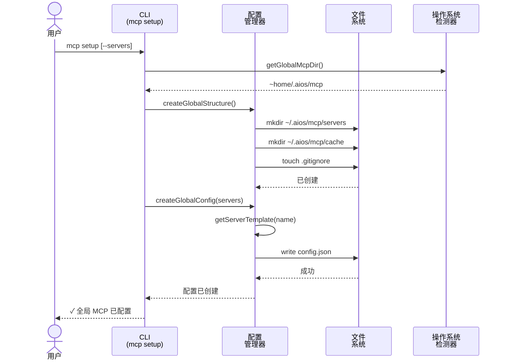
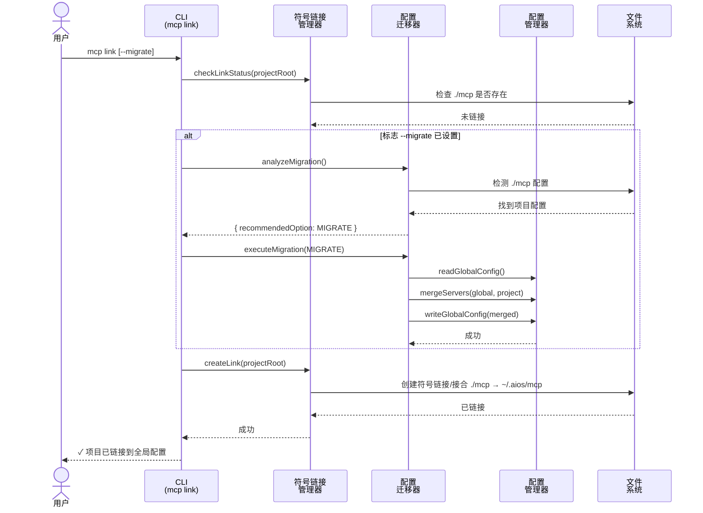

<!-- 翻译: ZH-CN | 原文: /docs/en/architecture/mcp-system-diagrams.md | 同步: 2026-02-22 -->

# 全局 MCP 系统 - 架构图

> 🌐 [EN](../../architecture/mcp-system-diagrams.md) | [PT](../../pt/architecture/mcp-system-diagrams.md) | **ZH** | [ES](../../es/architecture/mcp-system-diagrams.md)

---

**故事:** 2.11 - 全局 MCP 系统
**由以下生成:** CodeRabbit (PR #16)
**日期:** 2025-12-01

---

## MCP 设置流程

---

## MCP 链接流程 (带迁移)

---

## 组件概述

### 核心模块

| 模块 | 文件 | 目的 |
|------|------|------|
| **操作系统检测器** | `core/mcp/os-detector.js` | 跨平台操作系统/路径检测 |
| **配置管理器** | `core/mcp/global-config-manager.js` | 全局配置 CRUD 和服务器模板 |
| **符号链接管理器** | `core/mcp/symlink-manager.js` | 符号链接/接合管理 |
| **配置迁移器** | `core/mcp/config-migrator.js` | 项目到全局迁移，带 merge |

### CLI 命令

| 命令 | 文件 | 目的 |
|------|------|------|
| `mcp setup` | `cli/commands/mcp/setup.js` | 配置全局配置 |
| `mcp link` | `cli/commands/mcp/link.js` | 链接项目到全局 |
| `mcp status` | `cli/commands/mcp/status.js` | 显示配置状态 |
| `mcp add` | `cli/commands/mcp/add.js` | 添加/移除/启用服务器 |

---

## 复杂性分析 (CodeRabbit)

| 组件 | 复杂性 | 关键领域 |
|------|--------|---------|
| **config-migrator.js** | 高 | 多路径迁移逻辑、服务器 merge、冲突解决 |
| **symlink-manager.js** | 中 | 跨平台链接 (Unix 符号链接、Windows 接合) |
| **global-config-manager.js** | 中 | 服务器模板系统，带每服务器持久化 |
| **CLI 编排** | 中 | 多步骤验证、用户提示 |

**审查工作量估计:** 🎯 4 (复杂) | ⏱️ ~60 分钟

---

*由 CodeRabbit PR 审查生成 - 故事 2.11*
