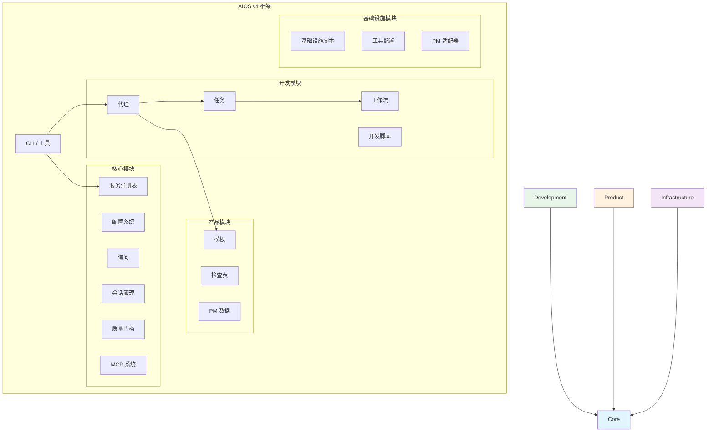
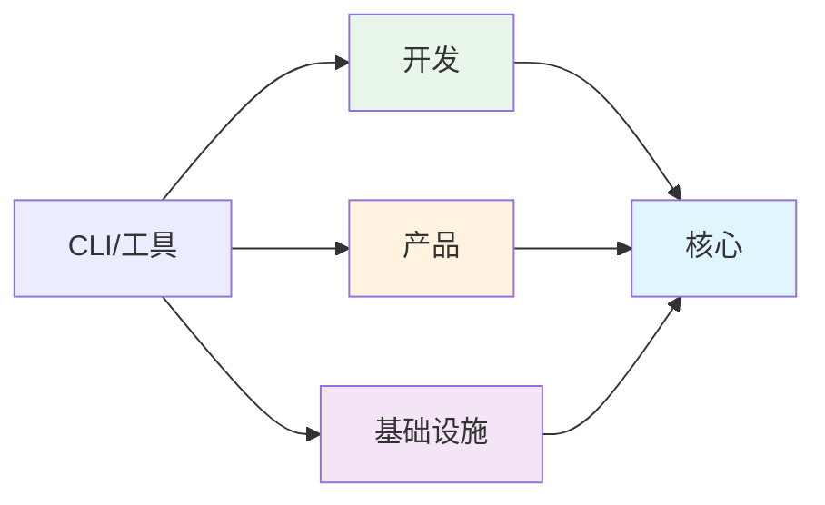

<!-- 翻译: ZH-CN | 原文: /docs/en/architecture/module-system.md | 同步时间: 2026-01-26 -->

# AIOS 模块系统架构

> 🌐 [EN](../../architecture/module-system.md) | [PT](../../pt/architecture/module-system.md) | [ES](../../es/architecture/module-system.md) | **ZH-CN**

---

> Synkra AIOS v4.2 模块化架构完整指南。

**版本:** 2.1.0
**上次更新:** 2025-12-01

---

## 概览

### 为什么要模块化架构？

v4.2 模块化架构解决了 v2.0 扁平结构的几个挑战：

| 挑战 | v2.0 问题 | v4.2 解决方案 |
| --- | --- | --- |
| **发现** | 200+ 文件混乱在目录中 | 按责任组织 |
| **维护** | 所有权不清楚 | 模块边界定义所有权 |
| **依赖** | 隐含的、循环的 | 显式的、单向的 |
| **可扩展性** | 总是加载所有文件 | 按模块延迟加载 |
| **测试** | 仅完整系统测试 | 模块级隔离 |

### 设计原则

1. **单一职责** - 每个模块有明确的目的
2. **显式依赖** - 模块声明所需内容
3. **松耦合** - 一个模块的变化不会传播
4. **高内聚** - 相关功能保持在一起
5. **延迟加载** - 仅加载必要内容

---

## 模块结构

Synkra AIOS 将 `.aios-core/` 目录组织为四个主要模块：

```
.aios-core/
├── core/              # 框架基础
├── development/       # 开发制品
├── product/           # 用户导向模板
└── infrastructure/    # 系统配置
```

### 模块图



---

## 核心模块

**路径:** `.aios-core/core/`
**目的:** 框架基础 - 配置、会话、询问和本质运行时组件。

### 内容

| 目录 | 内容 | 描述 |
| --- | --- | --- |
| `config/` | `config-cache.js`、`config-loader.js` | 带 TTL 缓存的配置管理 |
| `data/` | `aios-kb.md`、`workflow-patterns.yaml` | 框架知识库 |
| `docs/` | 内部文档 | 组件指南、故障排除 |
| `elicitation/` | `elicitation-engine.js`、`session-manager.js` | 交互式提示系统 |
| `session/` | `context-detector.js`、`context-loader.js` | 会话上下文管理 |
| `utils/` | `output-formatter.js`、`yaml-validator.js` | 常用实用程序 |
| `registry/` | `service-registry.json`、`registry-loader.js` | 服务发现系统 |
| `quality-gates/` | `quality-gate-manager.js`、层配置 | 3 层质量门槛系统 |
| `mcp/` | `global-config-manager.js`、`os-detector.js` | 全局 MCP 配置 |
| `manifest/` | `manifest-generator.js`、`manifest-validator.js` | 项目清单系统 |
| `migration/` | `migration-config.yaml`、`module-mapping.yaml` | 迁移配置 |

### 主要 API

```javascript
// 配置
const { loadAgentConfig, globalConfigCache } = require('./.aios-core/core');

// 会话
const { ContextDetector, SessionContextLoader } = require('./.aios-core/core');

// 询问
const { ElicitationEngine, ElicitationSessionManager } = require('./.aios-core/core');

// 注册表
const { getRegistry, loadRegistry } = require('./.aios-core/core/registry/registry-loader');

// 质量门槛
const QualityGateManager = require('./.aios-core/core/quality-gates/quality-gate-manager');
```

### 依赖项

- **外部:** `js-yaml`、`fs-extra`
- **内部:** 无（基础模块）

---

## 开发模块

**路径:** `.aios-core/development/`
**目的:** 代理相关资产 - 代理定义、任务、工作流和开发脚本。

### 内容

| 目录 | 内容 | 描述 |
| --- | --- | --- |
| `agents/` | 11 个代理定义 | `dev.md`、`qa.md`、`architect.md` 等 |
| `agent-teams/` | 5 个团队配置 | 预定义代理组 |
| `tasks/` | 115+ 任务定义 | 可执行任务工作流 |
| `workflows/` | 7 个工作流定义 | 多步开发工作流 |
| `scripts/` | 24 个脚本 | 代理支持实用程序 |

### 代理

| 代理 | ID | 责任 |
| --- | --- | --- |
| AIOS 主代理 | `aios-master` | 框架编排 |
| 开发者 | `dev` | 代码实现 |
| QA | `qa` | 质量保证 |
| 架构师 | `architect` | 技术架构 |
| 产品经理 | `po` | 产品待办 |
| 产品经理 | `pm` | 产品策略 |
| Scrum 主管 | `sm` | 过程协调 |
| 分析师 | `analyst` | 业务分析 |
| 数据工程师 | `data-engineer` | 数据工程 |
| DevOps | `devops` | CI/CD 和操作 |
| UX 专家 | `ux-design-expert` | 用户体验 |

### 代理团队

| 团队 | 代理 | 用例 |
| --- | --- | --- |
| `team-all` | 全部 11 个代理 | 完整开发团队 |
| `team-fullstack` | dev、qa、architect、devops | 全栈项目 |
| `team-ide-minimal` | dev、qa | 最小 IDE 设置 |
| `team-no-ui` | dev、architect、devops、data-engineer | 后端/API 项目 |
| `team-qa-focused` | qa、dev、architect | 质量关注工作 |

### 依赖项

- **内部:** `core/`（配置、会话、询问）

---

## 产品模块

**路径:** `.aios-core/product/`
**目的:** PM/PO 资产 - 模板、检查表和文档生成参考数据。

### 内容

| 目录 | 内容 | 描述 |
| --- | --- | --- |
| `templates/` | 52+ 模板 | PRD、故事、架构、IDE 规则 |
| `checklists/` | 11 个检查表 | 质量验证检查表 |
| `data/` | 6 个数据文件 | PM 知识库和参考 |

### 主要模板

| 模板 | 目的 |
| --- | --- |
| `story-tmpl.yaml` | v2.0 故事模板 |
| `prd-tmpl.yaml` | 产品需求文档 |
| `architecture-tmpl.yaml` | 架构文档 |
| `qa-gate-tmpl.yaml` | 质量门槛模板 |
| `ide-rules/` | 9 个 IDE 特定规则文件 |

### 检查表

- `architect-checklist.md` - 架构审查
- `pm-checklist.md` - PM 验证
- `po-master-checklist.md` - 主 PO 验证
- `story-dod-checklist.md` - 故事完成定义
- `pre-push-checklist.md` - 推送前验证
- `release-checklist.md` - 发布验证

### 依赖项

- **内部:** `core/`（模板引擎、验证器）
- **外部:** 无（静态资产）

---

## 基础设施模块

**路径:** `.aios-core/infrastructure/`
**目的:** 系统配置 - 脚本、工具和外部集成。

### 内容

| 目录 | 内容 | 描述 |
| --- | --- | --- |
| `scripts/` | 55+ 脚本 | 基础设施实用程序 |
| `tools/` | 工具配置 | CLI、MCP、本地工具配置 |
| `integrations/` | PM 适配器 | ClickUp、Jira、GitHub 适配器 |
| `tests/` | 模块测试 | 基础设施验证 |

### 主要脚本

| 脚本 | 目的 |
| --- | --- |
| `git-wrapper.js` | Git 操作包装器 |
| `backup-manager.js` | 备份/恢复系统 |
| `template-engine.js` | 模板处理 |
| `security-checker.js` | 安全验证 |
| `performance-analyzer.js` | 性能分析 |

### 工具配置

```
tools/
├── cli/           # CLI 工具配置 (gh, railway, supabase)
├── mcp/           # MCP 服务器配置
└── local/         # 本地工具配置
```

### 依赖项

- **内部:** `core/`（配置、实用程序）
- **外部:** 多个工具 API

---

## 模块边界

### 依赖规则



**规则:**

1. `core/` 没有内部依赖项
2. `development/`、`product/`、`infrastructure/` 仅依赖于 `core/`
3. 禁止循环依赖
4. CLI/工具可以访问任何模块

### 模块间通信

模块通过以下方式通信：

1. **服务注册表** - 发现可用的工作者和服务
2. **配置系统** - 共享设置和首选项
3. **事件系统** - 发布/订阅实现松耦合
4. **文件系统** - 共享数据目录

### 模块边界检查表

添加新功能时：

- [ ] 属于现有模块？
- [ ] 引入新依赖项？
- [ ] 维持单向依赖流？
- [ ] 与模块目的相聚合？
- [ ] 可以独立测试？

---

## 文件组织

### 命名约定

| 类型 | 约定 | 示例 |
| --- | --- | --- |
| 脚本 | `kebab-case.js` | `config-loader.js` |
| 代理 | `agent-id.md` | `dev.md`、`qa.md` |
| 任务 | `agent-prefix-task-name.md` | `dev-develop-story.md` |
| 模板 | `name-tmpl.yaml` | `story-tmpl.yaml` |
| 检查表 | `name-checklist.md` | `pre-push-checklist.md` |

### 添加新文件

| 文件类型 | 位置 | 模块 |
| --- | --- | --- |
| 代理定义 | `development/agents/` | 开发 |
| 任务定义 | `development/tasks/` | 开发 |
| 工作流 | `development/workflows/` | 开发 |
| 模板 | `product/templates/` | 产品 |
| 检查表 | `product/checklists/` | 产品 |
| 实用脚本 | `infrastructure/scripts/` | 基础设施 |
| 配置加载器 | `core/config/` | 核心 |
| 注册表 | `core/registry/` | 核心 |

---

## 从 v2.0 迁移

对于从扁平 v2.0 结构升级的项目：

```bash
# 预演显示变化
aios migrate --dry-run

# 执行迁移
aios migrate --from=2.0 --to=2.1

# 验证迁移
aios migrate --validate
```

详见 [迁移指南](../../migration/migration-guide.md) 了解详细说明。

---

## 相关文档

- [服务发现指南](../guides/service-discovery.md)
- [质量门槛指南](../guides/quality-gates.md)
- [全局 MCP 设置指南](../guides/mcp-global-setup.md)
- [迁移指南](../../migration/migration-guide.md)
- [ADR-002: 迁移地图](../../architecture/adr/ADR-002-migration-map.md)

---

_Synkra AIOS v4 模块系统架构_
