# 记忆智能系统 - 架构愿景

<!--
  本文件由翻译工具生成
  源文件: docs/guides/MEMORY-INTELLIGENCE-SYSTEM.md
  翻译日期: 2026-02-22
-->

**版本:** 2.1 (目标状态 — Core/Pro 分离)
**最后更新:** 2026-02-09
**作者:** @architect (Aria)
**Epic:** [MIS — 记忆智能系统](../stories/epics/epic-memory-intelligence-system/EPIC-MIS-INDEX.md)
**基于:** [MIS-1 调研](../stories/epics/epic-memory-intelligence-system/story-mis-1-investigation.md)
**当前文档:** [MEMORY-SYSTEM.md](MEMORY-SYSTEM.md) (当前状态 v1.0)
**标签:** memory, intelligence, session-digest, progressive-retrieval, self-learning, attention-routing, core-pro-split

> **注意:** 本文档描述了完成 Epic MIS 全部 7 个 stories 后记忆系统的**目标状态**。有关当前状态，请参阅 [MEMORY-SYSTEM.md](MEMORY-SYSTEM.md)。

> **架构:** MIS 遵循 AIOS 的 **Open Core** 模型。所有记忆智能都位于私有仓库 `aios-pro`（子模块 `pro/`）中。`aios-core`（开源）仅提供扩展点，并且在没有智能记忆的情况下 100% 正常运行 — 与现在完全一样。

---

## 目录

1. [概述](#概述)
2. [Core/Pro 分离策略](#corepro-分离策略)
3. [设计原则](#设计原则)
4. [四层架构](#四层架构)
5. [第一层: 捕获层](#第一层-捕获层)
6. [第二层: 存储层](#第二层-存储层)
7. [第三层: 检索层](#第三层-检索层)
8. [第四层: 演化层](#第四层-演化层)
9. [会话摘要流程 (PreCompact)](#会话摘要流程-precompact)
10. [代理记忆 API](#代理记忆-api)
11. [管道集成](#管道集成)
12. [记忆文件格式](#记忆文件格式)
13. [注意力评分与层级](#注意力评分与层级)
14. [认知领域](#认知领域)
15. [自学习与自动演化](#自学习与自动演化)
16. [持久化存储映射](#持久化存储映射)
17. [系统文件映射](#系统文件映射)
18. [差异对比: 当前状态 vs MIS](#差异对比-当前状态-vs-mis)
19. [Story 路线图](#story-路线图)
20. [研究参考](#研究参考)

---

## 概述

### 问题 (当前状态)

当前记忆系统在**两个断开的层**（Claude Code 原生 + AIOS 框架）上运行，存在关键缺口：

- **没有 session-digest** — 上下文知识在关闭会话时蒸发
- **没有智能检索** — 代理全量加载（200 行 MEMORY.md）
- **没有自学习** — 启发式规则、修正和公理在会话间丢失
- **2,397 行孤立代码** — 相互引用但没有消费者的模块
- **约 14K 行孤立数据** — 无人读取的文件
- **8 个损坏的路径** — 指向不存在的目录/文件的引用

### 解决方案: 记忆智能系统 (MIS)

MIS 将两层统一为一个智能的 4 层系统，遵循 **Open Core** 模型：

| 层 | 功能 | 仓库 | Story |
|--------|--------|-------------|-------|
| **清理** | 移除死代码，准备基础 | **aios-core** | MIS-2 |
| **捕获** | 通过 hooks 捕获会话知识 | **aios-pro** | MIS-3 |
| **存储** | 使用带 YAML frontmatter 的 Markdown 存储 | **aios-pro** | MIS-3, MIS-4 |
| **检索** | 按相关性渐进式检索 | **aios-pro** + **aios-core** 扩展点 | MIS-4, MIS-6 |
| **演化** | 自动学习和演化规则 | **aios-pro** | MIS-5, MIS-7 |

### 关键原则 (vs 当前状态)

| 方面 | 当前状态 | 使用 MIS (aios-pro 激活) | 没有 MIS (仅 aios-core) |
|---------|-------------|--------------------------|--------------------------|
| 会话结束 | 什么都不发生 | PreCompact digest 捕获学习成果 | 什么都不发生 (同当前) |
| 记忆加载 | MEMORY.md (200 行, 全量) | 渐进式披露 (HOT/WARM/COLD) | MEMORY.md (同当前) |
| 代理范围 | 全局记忆无过滤 | 按代理的私有 + 共享记忆 | 全局 (同当前) |
| 学习 | 手动 (Claude 决定保存) | 自动 (修正, 模式, 陷阱) | 手动 (同当前) |
| Token 使用 | 每会话约 10K tokens 固定 | 通过注意力路由减少 60-95% | 约 10K tokens (同当前) |

---

## Core/Pro 分离策略

### 基本原则

> **aios-core 在没有 MIS 的情况下 100% 正常运行** — 与现在的运行方式完全相同。当 `aios-pro` 存在时（子模块 `pro/`），MIS 通过扩展点自动连接。无需手动配置。

### Open Core 模型

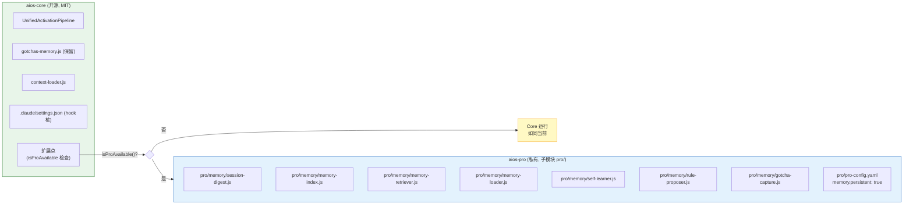

### 集成模式: pro-detector

aios-core 已有模块 `bin/utils/pro-detector.js` (Story PRO-5):

```javascript
const { isProAvailable, loadProModule } = require('../../bin/utils/pro-detector');

// 在 UnifiedActivationPipeline (Tier 2):
if (isProAvailable()) {
  const memoryLoader = loadProModule('memory/memory-loader');
  if (memoryLoader) {
    const memories = await memoryLoader.loadForAgent(agentId, { budget: 2000 });
    enrichedContext.memories = memories;
  }
}
// 如果 pro/ 不存在 → memoryLoader = null → 不加载记忆 → 运行如同当前
```

### Feature Gating

已在 `pro/feature-registry.yaml` 中注册的记忆功能：

| Feature ID | 描述 | Story MIS |
|-----------|-----------|-----------|
| `pro.memory.persistence` | 跨会话持久记忆 | MIS-3 |
| `pro.memory.extended` | AI 代理扩展上下文窗口 | MIS-4, MIS-6 |
| `pro.memory.search` | 跨记忆存储语义搜索 | MIS-4 |
| `pro.memory.sync` | 跨设备记忆同步 | 未来 |

待注册的附加功能：

| Feature ID (新) | 描述 | Story MIS |
|-------------------|-----------|-----------|
| `pro.memory.session_digest` | PreCompact 会话摘要捕获 | MIS-3 |
| `pro.memory.self_learning` | 从修正中自学习 | MIS-5 |
| `pro.memory.auto_evolution` | CLAUDE.md 和规则自动演化 | MIS-7 |

### 各仓库内容

#### aios-core (开源) — 仅扩展点

| 文件 | 类型 | 描述 |
|---------|------|-----------|
| `bin/utils/pro-detector.js` | 已存在 | `isProAvailable()`, `loadProModule()` |
| `.aios-core/development/scripts/unified-activation-pipeline.js` | 修改 | 在 Tier 2 添加 `if (isProAvailable())` 用于记忆加载 |
| `.aios-core/development/scripts/greeting-builder.js` | 修改 | 如果 pro 可用，在 greeting 中添加记忆统计 |
| `.aios-core/core/memory/gotchas-memory.js` | 保留 | 路径修复 (MIS-2)，独立运行 |
| `.aios-core/core/session/context-loader.js` | 保留 | 路径修复 (MIS-2)，独立运行 |
| `.claude/settings.json` | 修改 | 调用 `pro/` 脚本的 Hook 桩（如果不存在则优雅失败） |

#### aios-pro (私有) — 所有智能

| 文件 | MIS 层 | Story |
|---------|-----------|-------|
| `pro/memory/session-digest.js` | 捕获 | MIS-3 |
| `pro/memory/gotcha-capture.js` | 捕获 | MIS-3 |
| `pro/memory/memory-index.js` | 存储 | MIS-4 |
| `pro/memory/memory-retriever.js` | 检索 | MIS-4 |
| `pro/memory/self-learner.js` | 演化 | MIS-5 |
| `pro/memory/memory-loader.js` | 管道 | MIS-6 |
| `pro/memory/agent-memory-api.js` | 命令 | MIS-6 |
| `pro/memory/rule-proposer.js` | 演化 | MIS-7 |
| `pro/pro-config.yaml` | 配置 | MIS-3 (启用记忆标志) |
| `pro/feature-registry.yaml` | 配置 | MIS-3 (添加新 feature ID) |

### Hook 配置策略

Claude Code 的 hooks 在 `.claude/settings.json` (aios-core) 中配置。指向的脚本位于 `pro/`:

```json
{
  "hooks": {
    "PreCompact": [
      {
        "type": "command",
        "command": "node pro/memory/session-digest.js --mode=precompact",
        "timeout": 10000
      }
    ]
  }
}
```

**优雅降级:** 如果 `pro/` 不存在，Node.js 静默失败 (`Cannot find module`)，hook 不执行，Claude Code 正常继续。这是 hooks 的默认行为 — 失败不会阻塞会话。

**更健壮的替代方案 (推荐):** core 中的包装器在调用前检查 pro：

```json
{
  "hooks": {
    "PreCompact": [
      {
        "type": "command",
        "command": "node .aios-core/hooks/pro-hook-runner.js PreCompact",
        "timeout": 10000
      }
    ]
  }
}
```

```javascript
// .aios-core/hooks/pro-hook-runner.js (在 core 中, ~20 行)
const { isProAvailable, loadProModule } = require('../bin/utils/pro-detector');
const hookEvent = process.argv[2]; // PreCompact, Stop, 等

if (!isProAvailable()) process.exit(0); // 静默退出

const hookHandler = loadProModule(`memory/hooks/${hookEvent.toLowerCase()}`);
if (hookHandler && typeof hookHandler.run === 'function') {
  hookHandler.run(process.env).catch(() => process.exit(1));
} else {
  process.exit(0);
}
```

---

## 设计原则

从 10 个开源仓库调研 (MIS-1) 中得出的 7 个原则：

### 1. 文件优先 (basic-memory 模式)

记忆是带有 YAML frontmatter 的 Markdown 文件。Git 友好，人类可读，CLI 优先。如果索引损坏，从文件重建。

### 2. 渐进式披露 (claude-mem 模式)

三层检索以最小化 tokens：
- **索引:** 标题 + ID (~50 tokens)
- **上下文:** 相关片段 (~200 tokens)
- **详情:** 完整记忆 (~1000+ tokens)

### 3. 分层存储 (openclaw 模式)

记忆按持久性分类：
- **会话:** 临时性，会话结束即消失
- **每日:** 当天合并，自动清理
- **持久:** 永久知识，永不过期

### 4. 注意力路由 (claude-cognitive 模式)

每个记忆有一个注意力分数，决定加载层级：
- **HOT (>0.7):** 始终在上下文中 (~500 tokens max)
- **WARM (0.3-0.7):** 按需加载
- **COLD (<0.3):** 仅通过显式搜索

### 5. 认知领域 (OpenMemory 模式)

记忆按认知类型分类：
- **情景:** "发生了什么" (会话, 事件)
- **语义:** "我知道什么" (事实, 概念)
- **程序:** "如何做" (模式, 工作流)
- **反思:** "我学到了什么" (元认知)

### 6. 自学习 (claude-reflect 模式)

捕获用户修正，提取模式，以置信度分数提出规则。演化始终需要用户批准。

### 7. 代理范围 (cognee 模式)

每个代理有私有记忆 + 共享记忆访问权限。无交叉污染。

### 8. Open Core (AIOS PRO 模式)

所有记忆智能都是高级功能。核心版本没有它也能同样运行。集成通过扩展点 + `isProAvailable()` 自动进行。

---

## 四层架构

### 完整图表（含 Core/Pro 边界）

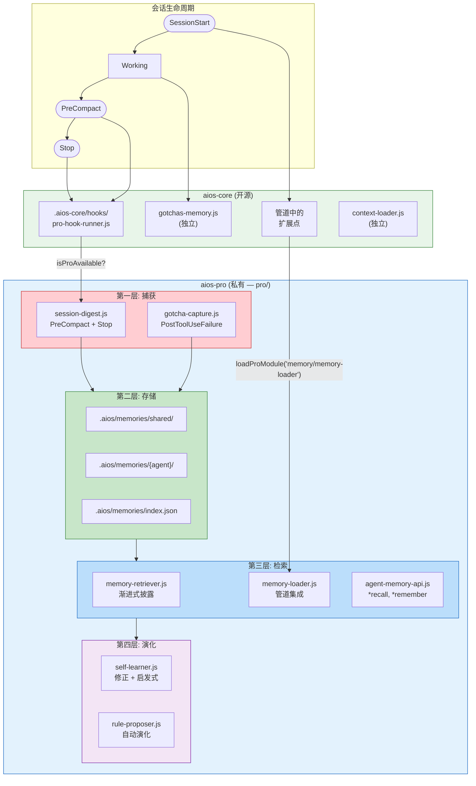

### 没有 Pro 的流程 (仅 aios-core)

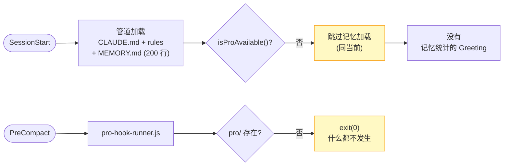

### 模块间关系

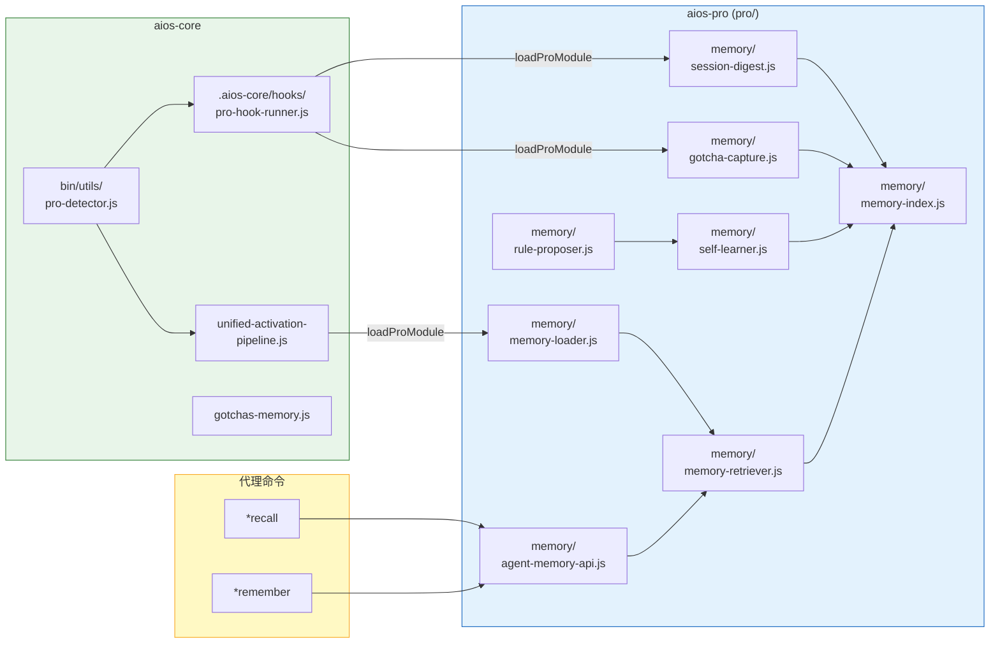

---

## 第一层: 捕获层

> **仓库:** `aios-pro` (pro/memory/)
> **core 中的扩展点:** `.aios-core/hooks/pro-hook-runner.js`

### 概述

捕获层通过 Claude Code hooks 拦截会话事件并提取结构化知识。捕获脚本位于 `pro/memory/`，由 core 的 `pro-hook-runner.js` 调用。

### 使用的 Hook 事件

| Hook 事件 | 触发时机 | Pro 脚本 | Core 回退 |
|-----------|---------------|-----------|---------------|
| `PreCompact` | 上下文接近限制 | `pro/memory/session-digest.js` | 无 (exit 0) |
| `Stop` | 会话结束 | `pro/memory/session-digest.js --final` | 无 (exit 0) |
| `PostToolUseFailure` | 工具失败 | `pro/memory/gotcha-capture.js` | `gotchas-memory.js` (core, 基础) |
| `TaskCompleted` | 任务完成 | `pro/memory/session-digest.js --task` | 无 (exit 0) |

### Hooks 配置

```json
// .claude/settings.json (aios-core — 已提交)
{
  "hooks": {
    "PreCompact": [
      {
        "type": "command",
        "command": "node .aios-core/hooks/pro-hook-runner.js PreCompact",
        "timeout": 10000
      }
    ],
    "Stop": [
      {
        "type": "command",
        "command": "node .aios-core/hooks/pro-hook-runner.js Stop",
        "timeout": 5000
      }
    ],
    "PostToolUseFailure": [
      {
        "type": "command",
        "command": "node .aios-core/hooks/pro-hook-runner.js PostToolUseFailure",
        "timeout": 3000
      }
    ]
  }
}
```

`pro-hook-runner.js` (~20 行，在 core 中) 检查 `isProAvailable()` 并委托给相应的 pro 脚本。如果 pro 不存在，静默退出。

### 提取器和分类器 (pro/memory/)

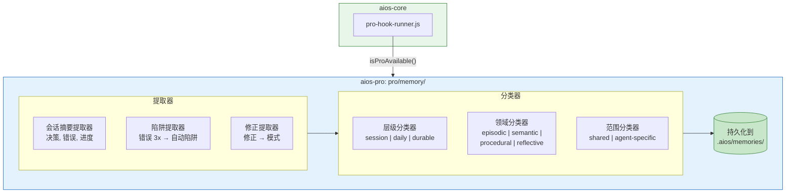

---

## 第二层: 存储层

> **仓库:** `aios-pro` (pro/memory/) 管理存储
> **存储位置:** `.aios/memories/` (gitignored, 由 pro 创建)

### 原则: 文件即记忆

每个记忆都是带有 YAML frontmatter 的 Markdown 文件。文件是真实来源。JSON 索引是派生的，可以随时重建。

### 目录结构

```
.aios/memories/                          # 由 pro/memory/ 创建和管理
  shared/                                # 跨代理记忆
    durable/                             # 永久知识
      2026-02-09-absolute-imports.md
    daily/                               # 每日合并
      2026-02-09/
        session-001-digest.md
    session/                             # 临时性 (下次启动时清理)
      current-session.md
  dev/                                   # @dev 私有记忆
    durable/
    daily/
  qa/                                    # @qa 私有记忆
    durable/
    daily/
  architect/                             # @architect 私有记忆
    durable/
    daily/
  index.json                             # 搜索索引 (从文件重建)

# Claude Code 原生 (不由 MIS 管理):
.claude/memory/MEMORY.md                 # 始终加载, 200 行
.claude/agent-memory/{agent}/MEMORY.md   # 每代理记忆
```

### 双存储策略

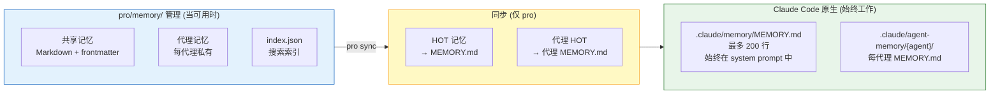

**没有 pro:** 原生 MEMORY.md 如同当前工作 — Claude 手动决定保存什么。
**有 pro:** MIS 将 HOT 记忆同步到 MEMORY.md，确保它们在 system prompt 中。

---

## 第三层: 检索层

> **仓库:** `aios-pro` (pro/memory/memory-retriever.js, memory-loader.js)
> **core 中的扩展点:** `unified-activation-pipeline.js` (Tier 2 条件加载)

### 渐进式披露 (3 个级别)

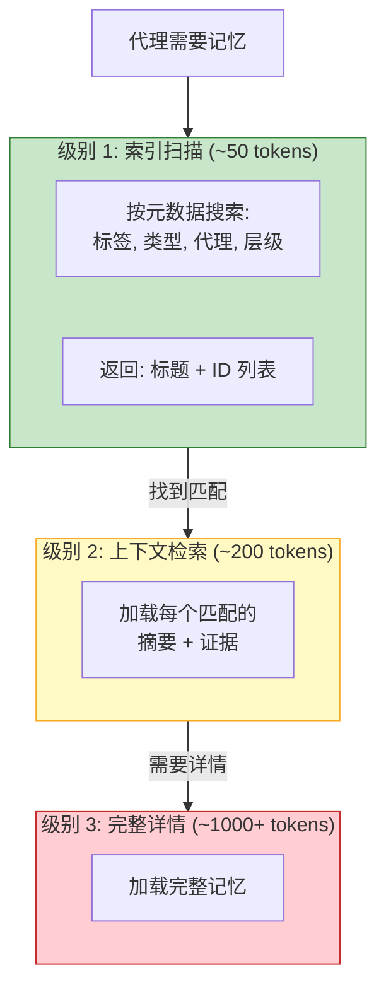

### Token 节省

| 场景 | Tokens | 减少 |
|---------|--------|---------|
| 没有 pro (仅 core, 原始 MEMORY.md) | ~10,000 | 0% |
| 有 pro + 渐进式披露 | ~2,000 | 80% |
| 有 pro + 注意力路由 | ~1,000 | 90% |
| 有 pro + 代理范围 | ~500 | 95% |

---

## 第四层: 演化层

> **仓库:** `aios-pro` (pro/memory/self-learner.js, rule-proposer.js)
> **core 中无扩展点** — 此层 100% pro

### 自动演化流程

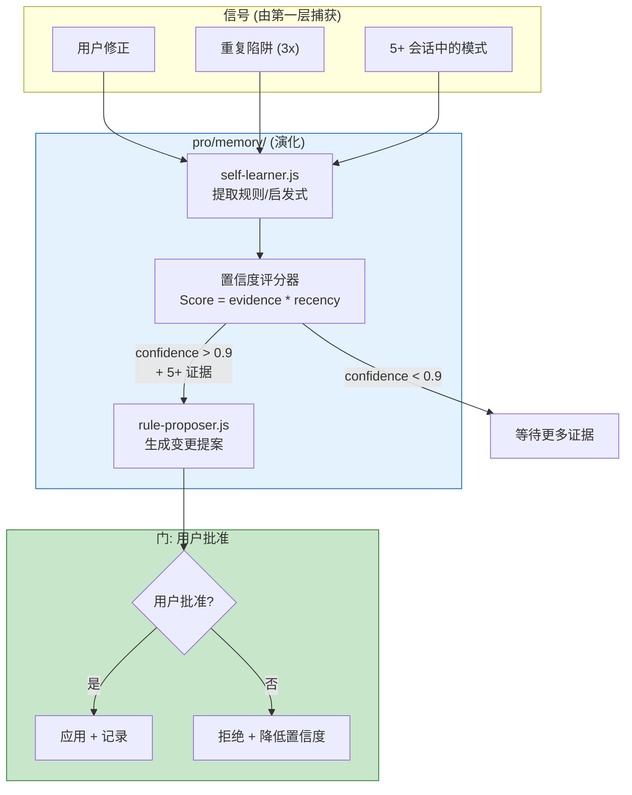

### 不可违反的规则

> **绝不自动修改用户的配置文件。** 始终提案 → 展示 → 等待明确批准。拒绝会降低置信度并记录原因。

---

## 会话摘要流程 (PreCompact)

### 带 Core/Pro 边界的流程

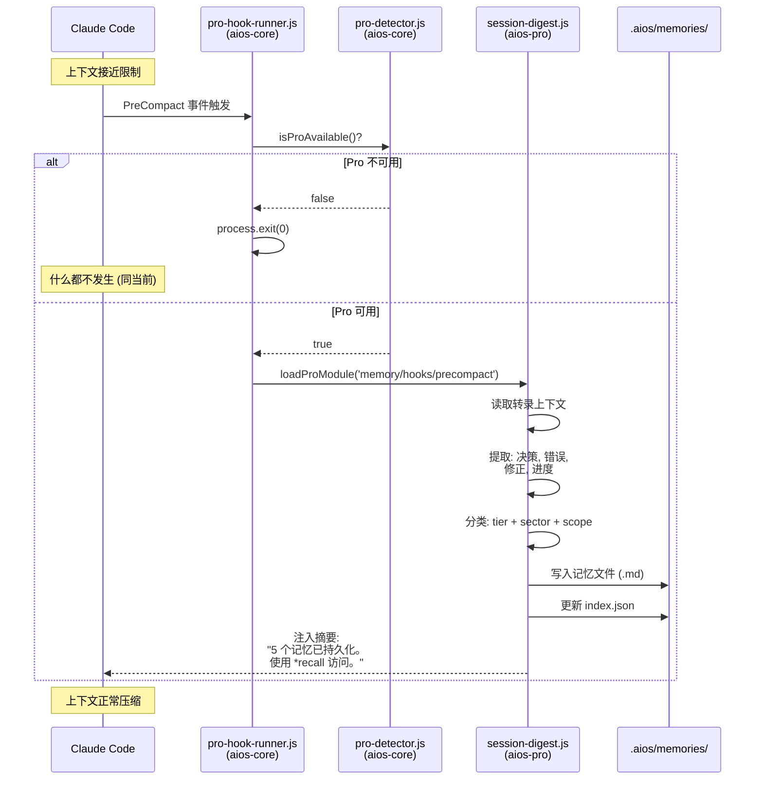

### PreCompact 技术能力

| 能力 | 状态 | 注释 |
|-----------|--------|------|
| 访问完整转录 | 可用 | 压缩前 |
| 执行 shell 脚本 | 可用 | 异步即发即忘 |
| 写入文件 | 可用 | session-digest.js 写入记忆 |
| 可配置超时 | 10 秒 | 足够用于摘要 |
| 异步模式 | 可用 (2026年1月) | 不阻塞压缩 |

---

## 代理记忆 API

> **仓库:** `aios-pro` (pro/memory/agent-memory-api.js)
> **没有 pro:** `*recall`, `*remember` 命令不存在 (代理如同当前运行)

### 可用命令 (有 pro)

```bash
# 搜索记忆
*recall {query}                    # 在所有可访问的记忆中搜索
*recall --agent dev                # 仅 @dev 的记忆
*recall --type procedural          # 仅程序知识
*recall --tier durable             # 仅永久记忆
*recall --recent 7d                # 最近 7 天

# 手动保存记忆
*remember "Always run tests before push"   # 保存为 durable + procedural

# 管理记忆
*forget {id}                       # 删除特定记忆
*memories                          # 列出最近记忆 (HOT + WARM)
*memories --stats                  # 使用统计
```

### 代理 → 可访问记忆映射

每个代理访问：
1. 自己的私有记忆 (`.aios/memories/{agent}/`)
2. 共享记忆 (`.aios/memories/shared/`)
3. **绝不** 其他代理的私有记忆

---

## 管道集成

> **core 中的扩展点:** `unified-activation-pipeline.js` (1 个 `isProAvailable` 检查)
> **pro 模块:** `pro/memory/memory-loader.js`

### 分层记忆加载

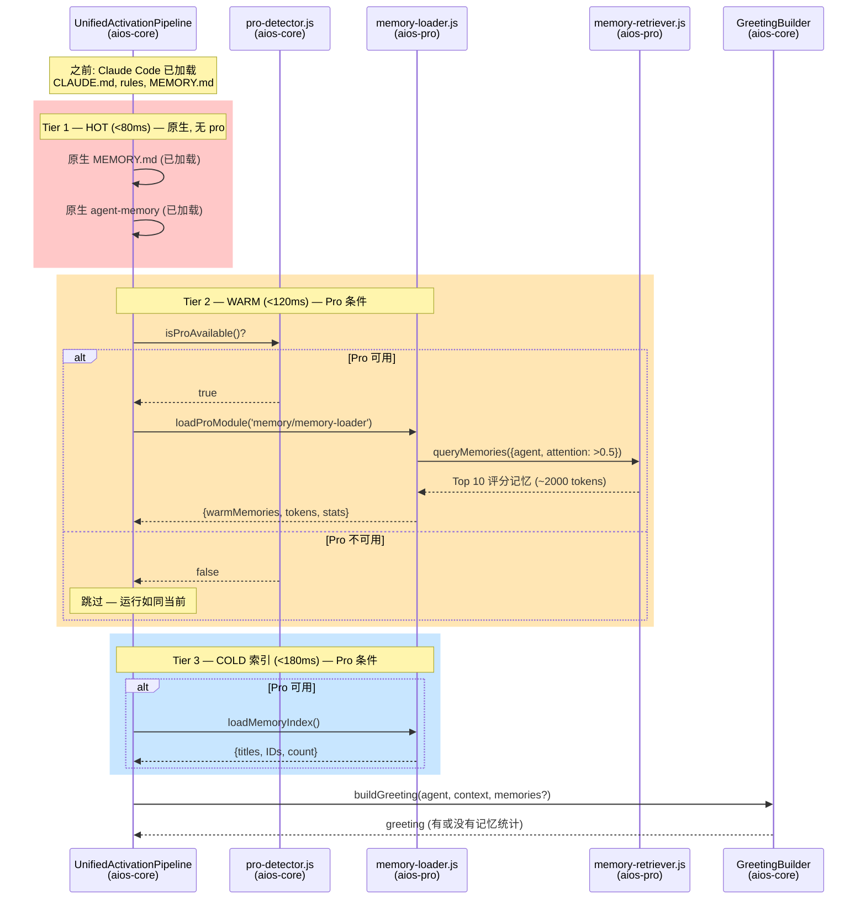

### Token 预算

| Tier | 有 Pro | 没有 Pro (仅 core) |
|------|---------|-------------------|
| HOT (Tier 1) | ~500 tokens | ~500 tokens (原生 MEMORY.md) |
| WARM (Tier 2) | ~2,000 tokens | 0 (跳过) |
| COLD (Tier 3) | ~200 tokens | 0 (跳过) |
| **总计** | **~2,700** | **~500** (同当前) |

---

## 记忆文件格式

### 规范 (.aios/memories/ 中的文件)

```markdown
---
id: mem-2026-02-09-001
type: procedural               # episodic | semantic | procedural | reflective
tier: durable                  # session | daily | durable
agent: shared                  # shared | dev | qa | architect | ...
tags: [imports, typescript, pattern, coding-standard]
confidence: 0.95
created: 2026-02-09T14:30:00Z
last_accessed: 2026-02-09T16:00:00Z
access_count: 3
source: user-correction         # user-correction | session-digest | auto-gotcha |
                                # manual | heuristic | task-outcome
attention_score: 0.85           # HOT (>0.7) | WARM (0.3-0.7) | COLD (<0.3)
related_memories: [mem-2026-02-08-003]
evidence_count: 5
---

# AIOS 中始终使用绝对导入

## 模式
为所有导入使用 `@/` 前缀。绝不使用相对导入 (`../`)。

## 证据
- 会话 abc123 中的用户修正 (2026-02-09)
- 由 CLAUDE.md 规则确认 (绝对导入, 第 VI 条)
- 应用于代码库中的 47 个文件

## 上下文
不可协商的编码标准。宪法第 VI 条。
```

---

## 注意力评分与层级

### 公式

```
attention_score = base_relevance * recency_factor * access_modifier * confidence

每层级的衰减率:
  session:  0.5   (每天减半)
  daily:    0.1   (适中)
  durable:  0.01  (非常慢)
```

### 层级分配

| 注意力分数 | 层级 | 管道 | 行为 |
|----------------|------|----------|--------------|
| > 0.7 | HOT | Tier 1 | 同步到 MEMORY.md (始终在 prompt 中) |
| 0.3 - 0.7 | WARM | Tier 2 | 在激活时注入 (如果在预算内) |
| < 0.3 | COLD | Tier 3 | 仅通过显式 `*recall` |
| < 0.1 (90+ 天) | ARCHIVE | — | 移动到 `.old/` |

---

## 认知领域

### 4 个领域 + 代理偏好

| 代理 | 优先领域 | 原因 |
|--------|---------------------|-------|
| `@dev` | 程序, 语义 | 如何做和哪些约定 |
| `@qa` | 反思, 情景 | 学到了什么和发生了什么 |
| `@architect` | 语义, 反思 | 我们知道什么和学到了什么 |
| `@pm` | 情景, 语义 | 发生了什么和项目事实 |
| `@devops` | 程序, 情景 | 如何操作和发生了什么 |

### 按领域衰减

| 领域 | 基础 TTL | 原因 |
|-------|---------|-------|
| 情景 | 7 天 * access_modifier | 旧会话失去相关性 |
| 语义 | 365 天 | 事实保持有效 |
| 程序 | 30 天 * last_used_modifier | 未使用的工作流衰减 |
| 反思 | 无限 | 学习成果是永久的 |

---

## 自学习与自动演化

> **100% 在 aios-pro 中** — core 中没有自学习组件

### 演化示例

**修正 → 规则:**
```
会话 1: 用户修正 "use npm not yarn" → confidence 0.3
会话 4: 同样模式 5 次 → confidence 0.95
→ 提案: 添加到 CLAUDE.md: "包管理器: npm"
→ 用户批准 → 规则应用
```

**陷阱 → 警告:**
```
会话 7: 错误 "EACCES permission denied" 3 次 → 自动陷阱
→ 陷阱持续 5+ 会话 → 升级为警告
→ 提案: 添加到 rules/: "警告: .aios/ 权限"
→ 用户批准 → 警告变为规则
```

---

## 持久化存储映射

```
.aios/                                        # 运行时状态 (gitignored)
├── memories/                                 # [PRO] 由 pro/memory/ 创建/管理
│   ├── shared/                               #   跨代理记忆
│   │   ├── durable/                          #     永久知识 (.md 文件)
│   │   ├── daily/{YYYY-MM-DD}/              #     每日摘要
│   │   └── session/                          #     临时性 (重启时清理)
│   ├── dev/                                  #   @dev 私有记忆
│   ├── qa/                                   #   @qa 私有记忆
│   ├── architect/                            #   @architect 私有记忆
│   ├── pm/, devops/, ...                     #   其他代理
│   ├── index.json                            #   搜索索引 (从 .md 重建)
│   └── stats.json                            #   使用分析
├── gotchas.json                              # [CORE] gotchas-memory.js (独立)
├── gotchas.md                                # [CORE] 人类可读陷阱
├── error-tracking.json                       # [CORE] 错误跟踪 (MIS-2 创建)
├── session-state.json                        # [CORE] 代理间传递
├── project-status.yaml                       # [CORE] 项目状态缓存
└── codebase-map.json                         # [CORE] 代码库结构

~/.claude/projects/.../
├── memory/MEMORY.md                          # [原生] 始终加载 (200 行)
└── {session-id}.jsonl                        # [原生] 完整转录

.claude/agent-memory/                         # [原生] 每代理记忆
├── aios-architect/MEMORY.md
├── aios-dev/MEMORY.md
└── .../MEMORY.md
```

**没有 pro:** 仅 `[CORE]` 和 `[原生]` 存在。`[PRO]` (.aios/memories/) 永远不会创建。

---

## 系统文件映射

### aios-core (开源) — 扩展点

| 文件 | 类型 | Story | 描述 |
|---------|------|-------|-----------|
| `bin/utils/pro-detector.js` | 已存在 (PRO-5) | — | `isProAvailable()`, `loadProModule()` |
| `.aios-core/hooks/pro-hook-runner.js` | **新建** | MIS-3 | 包装器: 检查 pro, 委托 hook (~20 行) |
| `.aios-core/development/scripts/unified-activation-pipeline.js` | **修改** | MIS-6 | 在 Tier 2 添加 `if (isProAvailable())` |
| `.aios-core/development/scripts/greeting-builder.js` | **修改** | MIS-6 | 如果 pro 可用，在 greeting 中显示记忆统计 |
| `.aios-core/core/memory/gotchas-memory.js` | **路径修复** | MIS-2 | 修正 `.aios/error-tracking.json` |
| `.aios-core/core/session/context-loader.js` | **路径修复** | MIS-2 | 修正 `.aios/session-state.json` |
| `.claude/settings.json` | **修改** | MIS-3 | 通过 pro-hook-runner.js 的 Hook 桩 |

### aios-pro (私有) — 所有智能

| 文件 | 层 | Story | 描述 |
|---------|--------|-------|-----------|
| `pro/memory/hooks/precompact.js` | 捕获 | MIS-3 | PreCompact 时的会话摘要 |
| `pro/memory/hooks/stop.js` | 捕获 | MIS-3 | Stop 时的最终刷新 |
| `pro/memory/hooks/tooltfailure.js` | 捕获 | MIS-3 | 增强的陷阱捕获 |
| `pro/memory/memory-index.js` | 存储 | MIS-4 | 索引管理器 (构建, 搜索, 更新) |
| `pro/memory/memory-retriever.js` | 检索 | MIS-4 | 渐进式披露检索器 |
| `pro/memory/self-learner.js` | 演化 | MIS-5 | 修正跟踪器 + 启发式提取器 |
| `pro/memory/memory-loader.js` | 管道 | MIS-6 | 管道集成 (Tier 2/3 加载) |
| `pro/memory/agent-memory-api.js` | 命令 | MIS-6 | `*recall`, `*remember`, `*forget` |
| `pro/memory/rule-proposer.js` | 演化 | MIS-7 | CLAUDE.md + rules 自动演化 |
| `pro/pro-config.yaml` | 配置 | MIS-3 | 启用记忆标志 |
| `pro/feature-registry.yaml` | 配置 | MIS-3 | 添加 MIS feature ID |

### 删除的文件 (MIS-2, aios-core)

| 文件 | 行数 | 原因 |
|---------|--------|-------|
| `.aios-core/core/memory/timeline-manager.js` | 746 | 0 个消费者 (孤立) |
| `.aios-core/core/memory/file-evolution-tracker.js` | 1,003 | 0 个消费者 (孤立) |
| `.aios-core/core/memory/context-snapshot.js` | 648 | 0 个消费者 (孤立) |
| `.aios-core/elicitation/session-manager.js` | — | 死代码 |
| `.aios/compound-analysis/` | ~14K | 0 个读取者 (孤立数据) |

---

## 差异对比: 当前状态 vs MIS

| 方面 | 当前 aios-core | aios-core + aios-pro (MIS) | 没有 pro 的 aios-core |
|---------|---------------|---------------------------|------------------|
| **层** | 2 个断开的 | 4 个通过 pro 集成的 | 2 个断开的 (同当前) |
| **会话结束** | 无 | PreCompact digest + Stop flush | 无 (同当前) |
| **记忆加载** | MEMORY.md 全量 | 渐进式 HOT/WARM/COLD | MEMORY.md (同当前) |
| **代理范围** | 单一全局 | 按代理的私有 + 共享 | 全局 (同当前) |
| **搜索** | 无 | FTS 索引 + 元数据 | 无 (同当前) |
| **学习** | 手动 | 自动 | 手动 (同当前) |
| **死代码** | 2,397 行 | 已删除 | 已删除 (MIS-2) |
| **Token 使用** | ~10K 固定 | ~2,700 (~73% 减少) | ~10K (同当前) |
| **Hooks** | 仅 Gemini | Claude Code 原生 | Hook 桩 (no-op) |

---

## Story 路线图

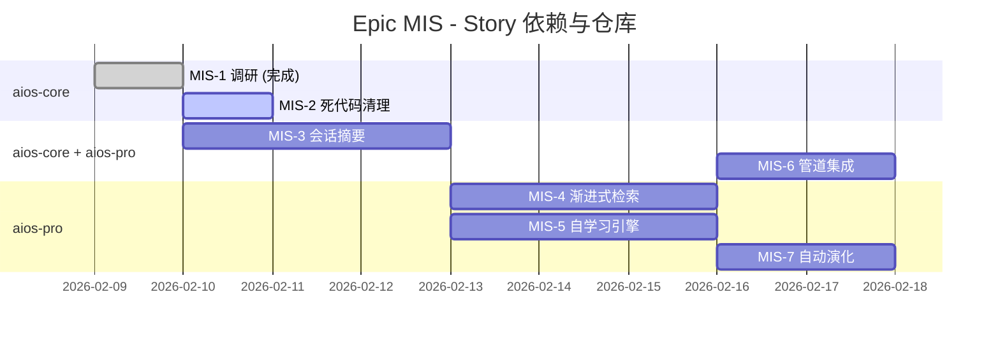

| Story | 标题 | 仓库 | 依赖 | 工时 |
|-------|--------|-------------|------------|-------|
| MIS-1 | 调研与架构设计 | docs (aios-core) | — | 12h (完成) |
| MIS-2 | 死代码清理与路径修复 | **aios-core** | MIS-1 | 4h |
| MIS-3 | 会话摘要 (PreCompact Hook) | **aios-core** (hook runner) + **aios-pro** (digest) | MIS-1 | 14h |
| MIS-4 | 渐进式记忆检索 | **aios-pro** | MIS-3 | 16h |
| MIS-5 | 自学习引擎 | **aios-pro** | MIS-3, MIS-4 | 14h |
| MIS-6 | 管道集成与代理记忆 API | **aios-core** (扩展点) + **aios-pro** (loader) | MIS-4 | 10h |
| MIS-7 | CLAUDE.md 与规则自动演化 | **aios-pro** | MIS-5 | 8h |
| **总计** | | | | **~78h** |

---

## 研究参考

### Top 3 灵感仓库

| 仓库 | 契合度 | 采纳的模式 |
|------|-----------|-------------------|
| **basic-memory** | 9/10 | 文件优先存储 (Markdown + frontmatter, git 友好) |
| **claude-cognitive** | 9/10 | HOT/WARM/COLD 注意力层级, 多实例记忆池 |
| **openclaw** | 9/10 | 三层模型, PreCompact 会话摘要 |

### 相关文档

| 资源 | 路径 |
|---------|---------|
| 当前状态 (v1.0) | [MEMORY-SYSTEM.md](MEMORY-SYSTEM.md) |
| Epic MIS 索引 | [EPIC-MIS-INDEX.md](../stories/epics/epic-memory-intelligence-system/EPIC-MIS-INDEX.md) |
| MIS-1 调研 | [story-mis-1-investigation.md](../stories/epics/epic-memory-intelligence-system/story-mis-1-investigation.md) |
| MIS-2 死代码清理 | [story-mis-2-dead-code-cleanup.md](../stories/epics/epic-memory-intelligence-system/story-mis-2-dead-code-cleanup.md) |
| Epic PRO 架构 | [EPIC-PRO-INDEX.md](../stories/epics/epic-pro-aios-pro-architecture/EPIC-PRO-INDEX.md) |
| ADR-PRO-001 仓库策略 | [adr-pro-001-repository-strategy.md](../architecture/adr/adr-pro-001-repository-strategy.md) |
| ADR-PRO-003 Feature Gating | [adr-pro-003-feature-gating-licensing.md](../architecture/adr/adr-pro-003-feature-gating-licensing.md) |
| Pro Detector | [bin/utils/pro-detector.js](../../bin/utils/pro-detector.js) |
| Feature Registry | [pro/feature-registry.yaml](../../pro/feature-registry.yaml) |

---

*AIOS 记忆智能系统 — 架构愿景 v4.0.4 (Core/Pro 分离)*
*Epic MIS 完成后的目标状态 (7 个 stories, ~78 小时)*
*aios-core: 扩展点 + 死代码清理*
*aios-pro: 所有记忆智能 (捕获, 存储, 检索, 演化)*
*@architect (Aria) — 架构未来*
