# 记忆系统 - 完整架构指南

<!--
  本文件由翻译工具生成
  源文件: docs/guides/MEMORY-SYSTEM.md
  翻译日期: 2026-02-22
-->

**版本:** 1.0
**最后更新:** 2026-02-09
**作者:** @architect (Aria)
**标签:** memory, session, persistence, context, gotchas, timeline, hooks

---

## 目录

1. [概述](#概述)
2. [完整架构图](#完整架构图)
3. [第一层: Claude Code 原生](#第一层-claude-code-原生)
4. [第二层: AIOS 框架](#第二层-aios-框架)
5. [代理激活流程 (记忆加载)](#代理激活流程-记忆加载)
6. [持久化流程 (记忆保存)](#持久化流程-记忆保存)
7. [会话生命周期流程](#会话生命周期流程)
8. [Gotchas 记忆 - 自动捕获流程](#gotchas-记忆---自动捕获流程)
9. [上下文快照与恢复](#上下文快照与恢复)
10. [Timeline Manager - 统一门面](#timeline-manager---统一门面)
11. [Hooks 系统 - 跨 CLI 抽象](#hooks-系统---跨-cli-抽象)
12. [完整文件映射](#完整文件映射)
13. [持久化存储映射](#持久化存储映射)
14. [已知缺口与限制](#已知缺口与限制)
15. [参考](#参考)

---

## 概述

AIOS 的记忆系统在**两个独立的层**上运行，它们共存但**彼此不通信**：

| 层 | 管理者 | 范围 |
|--------|---------------|--------|
| **第一层: Claude Code 原生** | Claude Code CLI | 自动记忆, CLAUDE.md, 会话转录 |
| **第二层: AIOS 框架** | `.aios-core/` 中的 JS 脚本 | Gotchas, 会话状态, 上下文快照, Timeline |

### 关键原则

- **没有自动 session-digest** — 当 Claude Code 会话关闭时，不会发生汇总
- **没有自动 memory-flush** — MEMORY.md 仅在会话期间由 Claude 更新
- **会话 hooks 存在于 Gemini** 但未在 Claude Code 中连接
- **每层独立持久化** — `.claude/` vs `.aios/`

---

## 完整架构图

### 两层视图


### 脚本间关系


---

## 第一层: Claude Code 原生

### 加载层次结构 (每个新会话)


### 自动记忆 — 读写流程


### 代理记忆 — 按代理


---

## 第二层: AIOS 框架

### 4 个记忆模块视图


### 3 个会话模块视图


---

## 代理激活流程 (记忆加载)

### 带分层加载的完整管道


---

## 持久化流程 (记忆保存)

### 每种记忆类型何时何处保存


### 详细流程: context-loader 保存


---

## 会话生命周期流程

### 会话完整周期


### 崩溃检测与恢复


---

## Gotchas 记忆 - 自动捕获流程


### 存储格式 — gotchas.json


---

## 上下文快照与恢复

```mermaid
flowchart TD
    subgraph CAPTURE["捕获 — context-snapshot.js"]
        C1(["snapshot.capture(context)"]) --> C2["生成唯一 ID (crypto)"]
        C2 --> C3["捕获 git 状态:<br/>分支, 提交, 脏文件"]
        C3 --> C4["记录:<br/>storyId, agent, subtask,<br/>工作目录"]
        C4 --> C5["保存 .aios/snapshots/{id}.json"]
        C5 --> C6{"autoCleanup?"}
        C6 -->|"是"| C7["移除快照:<br/>- > 50 个存在<br/>- > 7 天"]
    end

    subgraph RESTORE["恢复 — 恢复"]
        R1(["snapshot.restore(id)"]) --> R2["读取 .aios/snapshots/{id}.json"]
        R2 --> R3["返回完整上下文"]
        R3 --> R4["代理可以从<br/>上次位置恢复"]
    end

    subgraph LIST["列出 — 查询"]
        L1(["snapshot.list()"]) --> L2["列出 .aios/snapshots/ 中所有"]
        L2 --> L3["按时间戳排序"]
        L3 --> L4["返回元数据数组"]
    end

    style CAPTURE fill:#E3F2FD,stroke:#1565C0
    style RESTORE fill:#E8F5E9,stroke:#2E7D32
    style LIST fill:#FFF9C4,stroke:#F9A825
```



---

## Timeline Manager - 统一门面


---

## Hooks 系统 - 跨 CLI 抽象

### EVENT_MAPPING — CLI 间事件映射


### 各 CLI 的 Hooks 状态

| Hook | 文件 | Gemini | Claude Code | 状态 |
|------|---------|--------|-------------|--------|
| `session-start` | `hooks/gemini/session-start.js` | `SessionStart` | `null` (无事件) | **仅 Gemini** |
| `session-end` | `hooks/gemini/session-end.js` | `SessionEnd` | `Stop` (已映射但未连接) | **仅 Gemini** |
| `before-agent` | `hooks/gemini/before-agent.js` | `BeforeAgent` | `PreToolUse` | 两者都有 |
| `before-tool` | `hooks/gemini/before-tool.js` | `BeforeTool` | `PreToolUse` | 两者都有 |
| `after-tool` | `hooks/gemini/after-tool.js` | `AfterTool` | `PostToolUse` | 两者都有 |

### 关键缺口: Claude Code 中的 session-start


---

## 完整文件映射

### 记忆系统脚本

| 文件 | 模块 | Story/Epic | 功能 |
|---------|--------|------------|--------|
| `.aios-core/core/memory/gotchas-memory.js` | 记忆 | Epic 9, Story 9.4 | 自动捕获重复错误, 手动 gotchas, 注入任务 |
| `.aios-core/core/memory/context-snapshot.js` | 记忆 | Story 12.6 | 捕获和恢复开发上下文 |
| `.aios-core/core/memory/file-evolution-tracker.js` | 记忆 | Gap impl | 追踪文件演化, 检测漂移 |
| `.aios-core/core/memory/timeline-manager.js` | 记忆 | Gap impl | 跨会话统一 timeline 门面 |
| `.aios-core/core/session/context-loader.js` | 会话 | Story 2.2, 6.1.2.5 | 代理间连续性, 上下文交接 |
| `.aios-core/core/session/context-detector.js` | 会话 | Story 2.2 | 混合会话类型检测 (new/existing/workflow) |
| `.aios-core/core/orchestration/session-state.js` | 编排 | Story 11.5 | Epic/story 持久状态, 崩溃恢复 |
| `.aios-core/core/orchestration/context-manager.js` | 编排 | Legacy | 阶段间工作流状态 (迁移到 session-state) |
| `.aios-core/core/elicitation/session-manager.js` | Elicitation | — | Elicitation 会话保存/加载 |

### 激活脚本 (消费记忆)

| 文件 | 功能 |
|---------|--------|
| `.aios-core/development/scripts/unified-activation-pipeline.js` | 主编排器 — 在 Tier 3 加载会话 |
| `.aios-core/development/scripts/greeting-builder.js` | 构建带会话/记忆上下文的 greeting |

### Hooks (会话持久化)

| 文件 | CLI | 功能 |
|---------|-----|--------|
| `.aios-core/hooks/gemini/session-start.js` | Gemini | 会话开始时加载 AIOS 上下文 |
| `.aios-core/hooks/gemini/session-end.js` | Gemini | 将会话摘要持久化到 `.aios/sessions/` |
| `.aios-core/hooks/gemini/before-agent.js` | Gemini | 代理前预处理 |
| `.aios-core/hooks/gemini/before-tool.js` | 两者 | 工具前预处理 |
| `.aios-core/hooks/gemini/after-tool.js` | 两者 | 工具后后处理 |
| `.aios-core/hooks/unified/hook-interface.js` | 两者 | UnifiedHook 基类 + EVENT_MAPPING |
| `.aios-core/hooks/unified/hook-registry.js` | 两者 | hooks 中央注册表 |
| `.aios-core/hooks/unified/index.js` | 两者 | 统一系统入口点 |

### Claude Code 文件 (原生记忆)

| 文件 | 功能 |
|---------|--------|
| `~/.claude/CLAUDE.md` | 全局指令 (始终加载) |
| `Workspaces/.claude/CLAUDE.md` | 工作区指令 (始终加载) |
| `aios-core/.claude/CLAUDE.md` | 项目指令 (始终加载) |
| `aios-core/.claude/rules/*.md` | 5 个规则文件 (始终加载) |
| `~/.claude/projects/.../memory/MEMORY.md` | 自动记忆 (前 200 行, 始终加载) |
| `~/.claude/projects/.../memory/compound-analysis/*.md` | 9 个合成分析文件 (从 MEMORY.md 引用) |
| `.claude/agent-memory/{agent}/MEMORY.md` | 每 squad 代理记忆 (6 个代理) |
| `~/.claude/settings.json` | 配置: language, thinking, plugins |

---

## 持久化存储映射

```
.aios/                                        # 运行时状态 (gitignored)
├── session-state.json                        # [context-loader] 代理间会话 (TTL: 1h)
├── gotchas.json                              # [gotchas-memory] 结构化 Gotchas
├── gotchas.md                                # [gotchas-memory] 可读 Gotchas
├── error-tracking.json                       # [gotchas-memory] 自动捕获追踪
├── snapshots/                                # [context-snapshot] 最多 50 个, 7 天
│   └── {id}.json                             #   单个快照
├── timeline/                                 # [timeline-manager]
│   └── unified-timeline.json                 #   统一 timeline (最多 5000, 90 天)
├── file-evolution/                           # [file-evolution-tracker]
│   └── evolution-index.json                  #   演化索引 (最多 1000, 30 天)
├── sessions/                                 # [hooks/gemini/session-end] 仅 Gemini
│   └── {sessionId}.json                      #   会话摘要
├── workflow-state/                           # [context-manager] LEGACY → 迁移到 session-state
├── cache/                                    # 摘要缓存
├── project-status.yaml                       # 项目状态
└── codebase-map.json                         # 代码库映射

docs/stories/
└── .session-state.yaml                       # [session-state] Epic 级持久 (无 TTL)

~/.claude/projects/.../
├── memory/
│   ├── MEMORY.md                             # [Claude Code] 自动记忆 (200 行在 prompt 中)
│   └── compound-analysis/                    # [外部] 9 个合成文件
│       ├── 00-manifest.json
│       ├── 01-learnings.md
│       ├── 02-frameworks.md
│       ├── 03-workflows.md
│       ├── 04-dos-and-donts.md
│       ├── 05-agent-patterns.md
│       ├── 06-heuristics.md
│       ├── 07-warnings.md
│       ├── 08-user-behavior.md
│       ├── 09-discrepancies.md
│       └── COMPOUND-SUMMARY.md
├── sessions-index.json                       # [Claude Code] 会话索引
└── {session-id}.jsonl                        # [Claude Code] 完整转录

.claude/agent-memory/                         # [Claude Code Agents] 每代理记忆
├── aios-architect/MEMORY.md
├── aios-dev/MEMORY.md
├── oalanicolas/MEMORY.md
├── pedro-valerio/MEMORY.md
├── sop-extractor/MEMORY.md
└── squad/MEMORY.md
```

---

## 已知缺口与限制

### 缺口 1: Claude Code 中没有 Session-Digest

```
影响: 高
```

当会话关闭时，上下文知识会**丢失**，除了：
- Claude 在会话**期间**写入 MEMORY.md 的内容
- `.jsonl` 中的原始转录 (未汇总)

**可能的缓解:** 通过 Claude Code 的 `Stop` 事件连接 `session-end.js` + 在 `.claude/settings.json` 中配置。

### 缺口 2: 没有自动 Memory-Flush

```
影响: 高
```

AIOS 模块 (gotchas, snapshots, timeline) 在会话结束时**不会自动 flush**。如果进程突然终止，内存中的数据可能丢失。

### 缺口 3: Gemini Hooks 未移植

```
影响: 中
```

`session-start.js` 在 Claude Code 中映射到 `null` (无原生事件)。`session-end.js` 映射到 `Stop` 但**未配置**。

### 缺口 4: 两层断开

```
影响: 中
```

Claude 自动记忆 (`MEMORY.md`) 和 AIOS 记忆 (`.aios/`) 从不同步。AIOS 捕获的 Gotchas 不会出现在 MEMORY.md 中，反之亦然。

### 缺口 5: compound-analysis 静态

```
影响: 低
```

`memory/compound-analysis/` 中的 9 个文件由外部工具生成，不会自动更新。

---

## 参考

| 资源 | 路径 |
|---------|---------|
| 激活管道指南 | `docs/guides/agents/traces/00-shared-activation-pipeline.md` |
| Gotchas 记忆脚本 | `.aios-core/core/memory/gotchas-memory.js` |
| 上下文快照脚本 | `.aios-core/core/memory/context-snapshot.js` |
| 文件演化追踪器 | `.aios-core/core/memory/file-evolution-tracker.js` |
| Timeline Manager | `.aios-core/core/memory/timeline-manager.js` |
| 会话上下文加载器 | `.aios-core/core/session/context-loader.js` |
| 上下文检测器 | `.aios-core/core/session/context-detector.js` |
| 会话状态 | `.aios-core/core/orchestration/session-state.js` |
| 统一 Hook 接口 | `.aios-core/hooks/unified/hook-interface.js` |
| Hook 注册表 | `.aios-core/hooks/unified/hook-registry.js` |
| Gemini Session Start | `.aios-core/hooks/gemini/session-start.js` |
| Gemini Session End | `.aios-core/hooks/gemini/session-end.js` |
| Core 配置 | `.aios-core/core-config.yaml` |
| Claude 设置 | `~/.claude/settings.json` |
| Story 开发周期 | `docs/guides/workflows/STORY-DEVELOPMENT-CYCLE-WORKFLOW.md` |

---

*AIOS 记忆系统架构指南 v1.0*
*从源代码追踪，而非文档。*
*@architect (Aria) — 架构未来*
