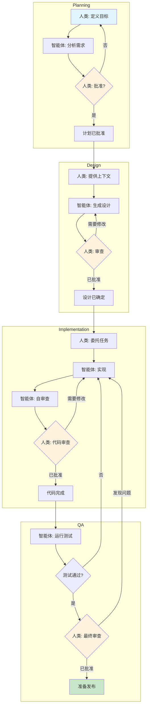
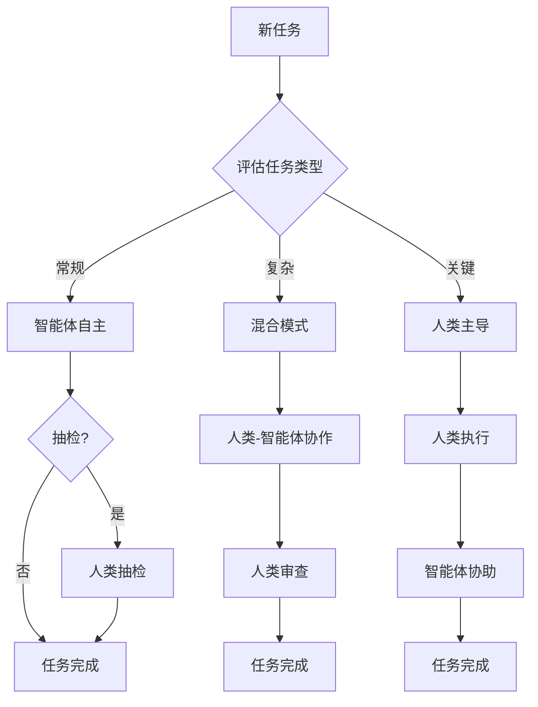
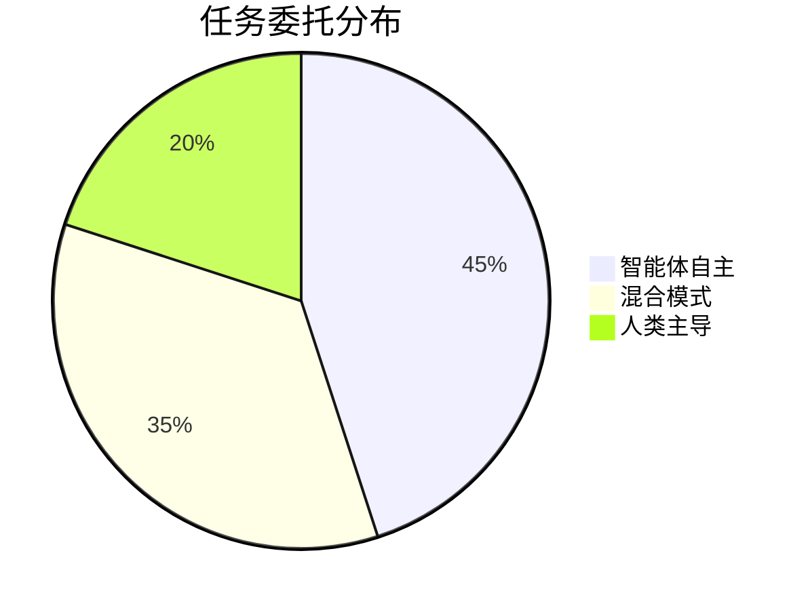

# HybridOps 工作流程图

**版本:** 1.0.0
**最后更新:** 2026-01-28
**状态:** 活跃

---

## 概述

HybridOps（混合操作）是一种用于编排人类-AI智能体协作的软件开发工作流程的方法论。它结合了AI智能体的优势和人类监督，以实现最优结果。

### 核心原则

| 原则 | 描述 |
| -------------------------- | ------------------------------------------------------------------------ |
| **混合执行** | 任务可以由人类、智能体或两者协作执行 |
| **渐进式委托** | 从人类监督开始，随着信任的建立逐步委托给智能体 |
| **质量检查点** | 在关键决策点进行人类审查 |
| **上下文交接** | 人类和智能体之间无缝的上下文传递 |

---

## 工作流程阶段

### 阶段1：规划

```
人类                    智能体
  │                        │
  │   定义目标              │
  │───────────────────────>│
  │                        │
  │   分析需求              │
  │<───────────────────────│
  │                        │
  │   审查并批准            │
  │───────────────────────>│
  │                        │
```

**职责:**

- 人类: 定义业务目标和约束
- 智能体: 分析技术需求并提出解决方案
- 人类: 审查分析结果并批准方向

### 阶段2：设计

```
人类                    智能体
  │                        │
  │   提供上下文            │
  │───────────────────────>│
  │                        │
  │   生成设计              │
  │<───────────────────────│
  │                        │
  │   根据反馈迭代          │
  │<──────────────────────>│
  │                        │
```

**职责:**

- 人类: 提供领域专业知识和上下文
- 智能体: 生成设计选项和文档
- 两者: 迭代设计直到获得批准

### 阶段3：实现

```
人类                    智能体
  │                        │
  │   委托任务              │
  │───────────────────────>│
  │                        │
  │   执行任务              │
  │<───────────────────────│
  │                        │
  │   审查代码              │
  │───────────────────────>│
  │                        │
  │   应用反馈              │
  │<───────────────────────│
  │                        │
```

**职责:**

- 人类: 定义任务范围和验收标准
- 智能体: 实现解决方案并编写测试
- 人类: 审查实现并提供反馈

### 阶段4：质量保证

```
人类                    智能体
  │                        │
  │   定义测试标准          │
  │───────────────────────>│
  │                        │
  │   执行测试              │
  │<───────────────────────│
  │                        │
  │   分析结果              │
  │<──────────────────────>│
  │                        │
  │   批准发布              │
  │───────────────────────>│
  │                        │
```

**职责:**

- 人类: 定义质量标准和边界情况
- 智能体: 执行自动化测试并生成报告
- 人类: 最终批准发布

---

## Mermaid 图表

### 完整工作流程



### 委托决策流程



### 任务类型分类



---

## 集成点

### 与AIOS智能体集成

| 集成 | 描述 |
| -------------- | ----------------------------------------------- |
| **@dev** | 编码任务的主要实现者 |
| **@qa** | 测试执行和质量验证 |
| **@architect** | 设计审查和技术指导 |
| **@pm** | 进度跟踪和利益相关者沟通 |

### 与质量门集成

HybridOps与AIOS 3层质量门集成:

| 层 | HybridOps角色 |
| ----------------------- | ------------------------------ |
| 第1层（提交前） | 智能体执行，人类监控 |
| 第2层（PR自动化） | 智能体+人类审查 |
| 第3层（最终审查） | 需要人类批准 |

### 与故事工作流集成

```
┌─────────────────────────────────────────────────────────────────┐
│                  HybridOps + 故事工作流                          │
│                                                                  │
│  创建故事        ──────────>  规划阶段                          │
│       │                              │                           │
│       ▼                              ▼                           │
│  需求分析        <──────────  智能体分析                        │
│       │                              │                           │
│       ▼                              ▼                           │
│  人类批准        ──────────>  实现                              │
│       │                              │                           │
│       ▼                              ▼                           │
│  QA审查          <──────────  智能体测试                        │
│       │                              │                           │
│       ▼                              ▼                           │
│  故事完成        <──────────  人类签收                          │
│                                                                  │
└─────────────────────────────────────────────────────────────────┘
```

---

## 最佳实践

### 对人类的建议

1. **清晰沟通** - 提供明确的目标和约束
2. **及时反馈** - 及时审查智能体输出以保持势头
3. **信任建立** - 从监督开始，随着信心增长而减少监督
4. **主动共享上下文** - 主动分享相关领域知识

### 对智能体的建议

1. **进度更新** - 在定义的检查点报告状态
2. **标记不确定性** - 明确标记需要人类输入的区域
3. **呈现选项** - 为人类决策呈现替代方案
4. **保持文档** - 维持清晰的决策审计跟踪

### 对两者的建议

1. **明确边界** - 清晰的任务所有权和交接点
2. **共享工件** - 使用通用文档和跟踪
3. **迭代改进** - 拥抱反馈循环
4. **学习循环** - 为未来改进捕获经验教训

---

## 相关文档

- [hybrid-ops-pv.yaml](./hybrid-ops-pv.yaml) - 工作流程定义
- [AIOS 高层架构](../../architecture/high-level-architecture.md)
- [CI/CD 架构](../../architecture/ci-cd.md)

---

_HybridOps 工作流程图 v1.0 - Pedro Valerio 方法论_
